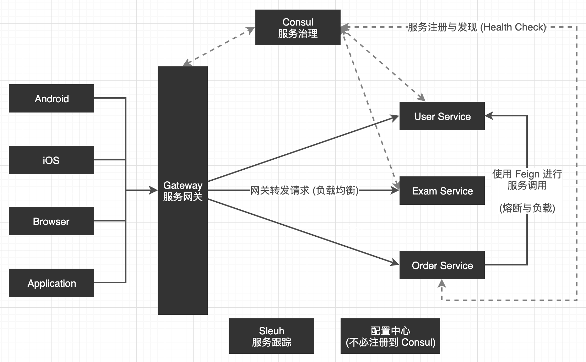

微服务架构风格是一种将一个单一应用程序开发为一组小型服务的方法，每个服务运行在自己的进程中，服务间通信采用轻量级通信机制 (通常用 HTTP 资源 API)。这些服务围绕业务能力构建并且可通过全自动部署机制独立部署。这些服务共用一个最小型的集中式的管理，服务可用不同的语言开发，使用不同的数据存储技术。

微服务架构应该具备以下特性：

* 每个微服务可独立运行在自己的进程里
* 一系列独立运行的微服务共同构建起整个系统
* 每个服务为独立的业务开发，一个微服务只关注某个特定的功能，例如订单管理，用户管理等
* 微服务之间通过一些轻量的通信机制进行通信，例如通过 RESTful API 进行调用
* 可以使用不同的语言与数据存储技术
* 全自动部署机制

可参考 [Spring Cloud 微服务架构简介](https://blog.51cto.com/5144104/2171025)。

微服务主要涉及几个功能 (简单的介绍一下):

* 服务治理 (服务注册与发现):

  服务提供者在启动时，将自己的网络地址等信息注册到服务发现组件中，服务发现组件会存储这些信息。

  服务消费者可以从服务发现组件查询服务提供者的网络地址，并使用该地址调用服务提供者的接口。

* 服务熔断:

  依赖的服务不能访问时，为了避免引起整个应用的崩溃或者直接抛出异常给前端，提供一个错误处理的机制，例如返回默认响应、友好提示、保存任务等待服务可用后继续执行等。

* 服务网关:

  典型的 Facade 模式，对外部屏蔽内部各具体的服务的 IP:Port，客户端统一与网关交互，使得与服务器的交互变得简单 (有几十上百个微服务时优势就很明显了)，可参考 [聊聊服务网关](https://blog.csdn.net/xc1158840657/article/details/90712084)

* 服务跟踪:

  在微服务架构下，由于进行了服务拆分，一次请求往往需要涉及多个服务，每个服务可能是由不同的团队开发，使用了不同的编程语言，还有可能部署在不同的机器上，分布在不同的数据中心。服务跟踪系统可以跟踪记录一次用户请求都发起了哪些调用，经过哪些服务处理，并且记录每一次调用所涉及的服务的详细信息，通过日志快速定位调用失败的环节，可参考[微服务之服务追踪](https://blog.csdn.net/haponchang/article/details/93486963)

Spring Cloud 的组件关系:

Spring Cloud 实现微服务很简单，一般都是引入对应模块的依赖，然后 application.properties 简单的配置一下，启动类上使用一下相关注解就可以了，因为主要的配置 Spring Boot 的各种 AutoConfiguration 都给我们做了。