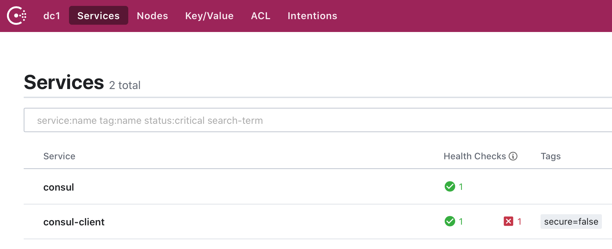

服务治理指的是服务的注册和发现，早些时候 Spring Cloud 的服务治理使用 Eureka，现在推荐使用 [Consul](https://www.consul.io)。

可以参考 [Spring Cloud Consul](https://www.springcloud.cc/spring-cloud-consul.html) 以及 [Spring Cloud 构建微服务架构: 服务注册与发现 (Eureka、Consul)](http://blog.didispace.com/spring-cloud-starter-dalston-1/) 了解更多信息。

## Consul 服务器

访问 <https://www.consul.io> 下载 Consul，然后执行 `./consul agent -dev` 启动 Consul 服务器 :

```
$ ./consul agent -dev

==> Starting Consul agent...
           Version: 'v1.6.3'
           Node ID: '4393e117-c621-2423-c4c5-aee4200e63ba'
         Node name: '192.168.0.105'
        Datacenter: 'dc1' (Segment: '<all>')
            Server: true (Bootstrap: false)
       Client Addr: [127.0.0.1] (HTTP: 8500, HTTPS: -1, gRPC: 8502, DNS: 8600)
      Cluster Addr: 127.0.0.1 (LAN: 8301, WAN: 8302)
           Encrypt: Gossip: false, TLS-Outgoing: false, TLS-Incoming: false, Auto-Encrypt-TLS: false
```

> 与 Eureka 不同的是，Consul 服务器不需要我们自己写服务器端程序，直接运行即可。

## Consul 客户端

Consul 客户端也就是我们的服务提供方和服务消费者，实现步骤如下:

* 创建一个基础的 Spring Boot 应用
* 引入 Consul 依赖
* 配置 Consul 服务器信息
* 在启动类上使用注解 `@EnableDiscoveryClient` 启用服务注册和发现
* 健康检查

### 引入 Consul 依赖:

```java
dependencies {
    implementation 'org.springframework.cloud:spring-cloud-starter-consul-discovery'
}

dependencyManagement {
    imports {
        mavenBom "org.springframework.cloud:spring-cloud-dependencies:Hoxton.SR1"
    }
}
```

### 配置 Consul 服务器信息:

在 application.properties 中配置:

```ini
server.port = 8080
spring.application.name = consul-client

# Consul 服务治理中心
spring.cloud.consul.host = localhost
spring.cloud.consul.port = 8500
```

其中:

* `spring.application.name` 为 Consol 的服务列表中服务的名字
* `spring.cloud.consul.host` 和 `spring.cloud.consul.port` 为 Consol 的服务器信息

### 在启动类上使用注解 `@EnableDiscoveryClient` 启用服务注册和发现:

```java
package com.xtuer.consulclient;

import org.springframework.boot.SpringApplication;
import org.springframework.boot.autoconfigure.SpringBootApplication;
import org.springframework.cloud.client.discovery.EnableDiscoveryClient;

@SpringBootApplication
@EnableDiscoveryClient
public class ConsulClientApplication {
	public static void main(String[] args) {
		SpringApplication.run(ConsulClientApplication.class, args);
	}
}
```

> 既能够在 Consul 上注册自己，同时也能够发现其他 Service Provider 提供的服务，也就是说，既可能是服务提供方，也可能是服务的消费者。通过**应用名 + URL** 就能够进行服务调用了。
>

## Consol 管理界面

打开 <http://localhost:8500> 就可以看到 Consol 的管理界面了。



## 健康检查

从上图中可以看到，`consul-client` 有一个红色的 **x** 提示，说明没有配置健康检查。

启用健康检查:

* 引入 actuator 依赖
* 配置健康检查

### 引入 actuator 依赖:

```java
implementation 'org.springframework.boot:spring-boot-starter-actuator'
```

### 配置健康检查:

```ini
spring.cloud.consul.discovery.healthCheckPath = /actuator/health
spring.cloud.consul.discovery.healthCheckInterval = 1s
```

