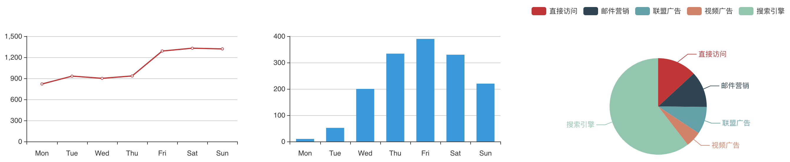

使用 [Echarts](https://www.echartsjs.com/examples/en/) 显示图表:

1. 在 `initCharts` 函数中统一预先配置好每个图表的选项，避免把配置信息分散得到处都是
2. 从服务器获取数据，设置到对应的 chart 上，这时我们更关心的是数据的使用，而不是图表的配置信息，Echarts 会很聪明的把多次 `setOption` 的配置进行合并，而不是替换。

> 提示: 在 html 中引入 echarts.min.js 或者动态加载，不要通过 webpack 使用 echarts，避免使得打包后首页太大。



```js
<template>
    <div class="about">
        <div ref="chart1"></div>
        <div ref="chart2"></div>
        <div ref="chart3"></div>
    </div>
</template>

<script>
export default {
    props: {},
    data() {
        return {
            chart1: {},
            chart2: {},
            chart3: {},
        };
    },
    mounted() {
        this.initCharts();

        // [2] 从服务器获取数据，设置到对应的 chart 上，这时我们更关心的是数据的使用，而不是图表的配置信息
        setTimeout(() => {
            this.chart1.setOption({
                xAxis : { data: ['Mon', 'Tue', 'Wed', 'Thu', 'Fri', 'Sat', 'Sun'] },
                series: [{ data: [820, 932, 901, 934, 1290, 1330, 1320] }],
            });

            this.chart2.setOption({
                xAxis : { data: ['Mon', 'Tue', 'Wed', 'Thu', 'Fri', 'Sat', 'Sun'] },
                series: [{ data: [10, 52, 200, 334, 390, 330, 220] }],
            });

            this.chart3.setOption({
                legend: { data: ['直接访问', '邮件营销', '联盟广告', '视频广告', '搜索引擎'] },
                series: [{ data: [
                    { value: 335,  name: '直接访问' },
                    { value: 310,  name: '邮件营销' },
                    { value: 234,  name: '联盟广告' },
                    { value: 135,  name: '视频广告' },
                    { value: 1548, name: '搜索引擎' },
                ] }],
            });
        }, 200);
    },
    methods: {
        // [1] 在 initCharts 函数中统一预先配置好每个图表的选项，避免把配置信息分散得到处都是
        //     下面的代码只是注释掉而没有删除，留着是为了便于理解此图表将要设置的数据，
        //     放一个初始数据是为了让图表显示默认效果，看上去更好一些，否则开始时是空白的
        initCharts() {
            // 曲线图
            this.chart1 = echarts.init(this.$refs.chart1);
            this.chart1.setOption({
                xAxis: {
                    type: 'category',
                    // data: ['Mon', 'Tue', 'Wed', 'Thu', 'Fri', 'Sat', 'Sun']
                },
                yAxis: {
                    type: 'value'
                },
                series: [{
                    type: 'line',
                    // data: [820, 932, 901, 934, 1290, 1330, 1320],
                    data: [0]
                }]
            });

            // 柱状图
            this.chart2 = echarts.init(this.$refs.chart2);
            this.chart2.setOption({
                color: ['#3398DB'],
                xAxis: {
                    type : 'category',
                    // data : ['Mon', 'Tue', 'Wed', 'Thu', 'Fri', 'Sat', 'Sun'],
                },
                yAxis: {
                    type : 'value'
                },
                series: [{
                    name: '直接访问',
                    type: 'bar',
                    barWidth: '60%',
                    // data: [10, 52, 200, 334, 390, 330, 220]
                    data: [0]
                }]
            });

            // 饼图
            this.chart3 = echarts.init(this.$refs.chart3);
            this.chart3.setOption({
                tooltip : {
                    trigger: 'item',
                    formatter: '{a} <br/>{b} : {c} ({d}%)'
                },
                legend: {
                    // data: ['直接访问', '邮件营销', '联盟广告', '视频广告', '搜索引擎']
                },
                series : [{
                    name  : '访问来源',
                    type  : 'pie',
                    radius: '55%',
                    center: ['50%', '60%'],
                    data  : [
                        { value: 0,  name: '无' },
                        // { value: 310,  name: '邮件营销' },
                        // { value: 234,  name: '联盟广告' },
                        // { value: 135,  name: '视频广告' },
                        // { value: 1548, name: '搜索引擎' },
                    ],
                }]
            });
        }
    }
};
</script>

<style lang="scss">
.about {
    display: grid;
    grid-template-rows: 300px;
    grid-template-columns: 1fr 1fr 1fr;
}
</style>
```

> 提示: 如果有多个同样的图表使用同样的配置，可以把配置定义为变量。

如果需要在弹窗 Modal 中显示图表，**且使用 flex 或者 grid 布局**，不能在 `mounted()` 中初始化，而应该在弹窗显示后的下一个事件循环中初始化图表，因为弹窗显示的这个事件循环中 Echarts 获取 chart 所属 DOM 元素的宽和高都为 0，可参考下面的代码:

```js
// 显示对话框
show() {
    this.modal = true;

    // 下一个事件循环中初始化图表，否则 echarts 得不到 DOM 的大小
    this.$nextTick(() => {
        this.initCharts(); // 如果要避免多次初始化，可以用一个变量控制一下
        this.showCharts();
    });
},
```

