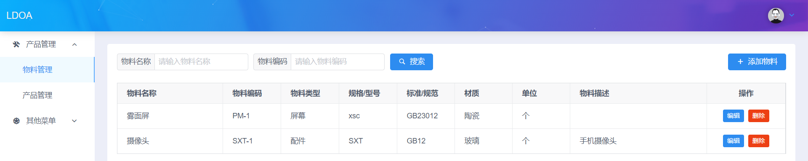

二级菜单可以硬编码，也可以像下面这样通过菜单项进行配置，方便以后对菜单进行权限控制.



```html
<!-- 页面布局 -->
<template>
    <div class="home">
        <!-- Header -->
        <Header>LDOA</Header>

        <div class="main">
            <!-- 左侧侧边栏 -->
            <div class="sidebar">
                <Menu :active-name="activeMenuItemName" :open-names="openSubMenuIndexes" width="auto" @on-select="navigateTo">
                    <Submenu v-for="(sm, index) in subMenus" :key="index" :name="index">
                        <template slot="title"><Icon :type="sm.icon" /> {{ sm.label }}</template>
                        <MenuItem v-for="item in sm.menuItems" :key="item.name" :name="item.name">{{ item.label }}</MenuItem>
                    </Submenu>
                </Menu>
            </div>

            <!-- 内容显示区 -->
            <div class="content">
                <Scroll>
                    <div class="content-wrapper">
                        <router-view/>
                    </div>
                </Scroll>
            </div>
        </div>
    </div>
</template>

<script>
import Header from '@/components/Header.vue';

export default {
    components: {
        Header,
    },
    data() {
        return {
            activeMenuItemName: '', // 当前菜单项名字
            openSubMenuIndexes: [], // 展开的子菜单下标

            // 所有菜单项，每个菜单项有不同的权限
            subMenus: [
                { label: '产品管理', icon: 'md-construct', menuItems:
                    [
                        { label: '物料管理', name: 'product-items' },
                        { label: '产品管理', name: 'products'      },
                    ]
                },
                { label: '其他菜单', icon: 'md-cog', menuItems:
                    [
                        { label: '订单管理', name: 'admin-courses'       },
                        { label: '用户管理', name: 'question-statistics' },
                    ]
                },
            ],
        };
    },
    mounted() {
        this.activeMenuItemName = this.$route.name;
    },
    methods: {
        // 路由跳转
        navigateTo(name) {
            this.$router.push({ name });
        },
        // 高亮菜单栏
        highlightMenu(menuItemName) {
            this.subMenus.forEach((sm, index) => {
                if (sm.menuItems.some(item => item.name === menuItemName)) {
                    this.activeMenuItemName = menuItemName;

                    if (!this.openSubMenuIndexes.includes(index)) {
                        this.openSubMenuIndexes.push(index);
                    }
                }
            });
        }
    },
    watch: {
        // 监听路由变化时高亮对应的菜单项
        $route: {
            immediate: true,
            handler(to, from) {
                this.highlightMenu(to.name);
            }
        }
    }
};
</script>

<style lang="scss">
.home {
    display: flex;
    flex-direction: column;
    width : 100vw;
    height: 100vh;

    > .header {
        box-shadow: 0 0px 15px #ccc;
        z-index: 1000;
        height: 60px;
    }

    > .main {
        display: flex;
        flex: 1;

        > .sidebar {
            width: 180px;

            // 隐藏 Menu 右边框
            .ivu-menu-vertical.ivu-menu-light::after {
                display: none;
            }

            .ivu-menu-light.ivu-menu-vertical .ivu-menu-item-active:not(.ivu-menu-submenu):after {
                background: #5cadff;
            }
        }

        > .content {
            flex: 1;
            background: #eceef8;
            padding: 24px;

            > .content-wrapper, > .__vuescroll > .__panel > .__view > .content-wrapper {
                padding: 18px;
                background: white;
                border-radius: 4px;
                overflow: auto;
                min-height: calc(100vh - 60px - 50px);
            }
        }
    }
}
</style>
```

