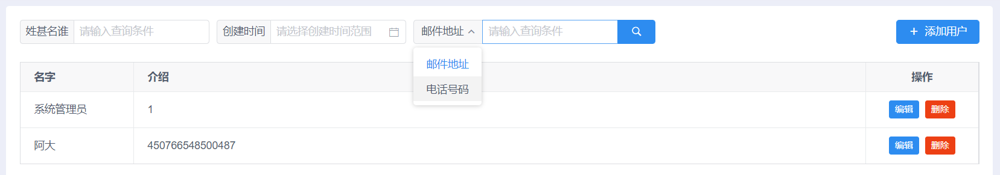

分页查询分为二种情况:

* 点击`加载更多按钮`加载下一页的数据，不需要计算出总页数
* 使用分页组件，`点击页码`加载对应页的数据，需要计算出总页面

下面以搜索用户为例，针对这二种情况分别提供不同的实现模板。

> 提示: 搜索的条件、页码、数量都作为 filter 的属性。

## 加载下一页用户

```js
<!--
搜索用户、分页加载 (加载下一页的用户)
-->
<template>
    <div class="about">
        <!-- 搜索工具栏 -->
        <div class="toolbar">
            <span>用户名:</span>
            <Input v-model="filter.name" placeholder="请输入用户名"/>
            <Button :loading="loading" type="primary" @click="searchUsers">搜索</Button>
        </div>

        <!-- 显示用户 -->
        <div v-for="user in users" :key="user.id">{{ user.name }}</div>

        <!-- 加载下一页用户按钮 -->
        <Button v-show="more" :loading="loading" icon="md-boat" @click="fetchMoreUsers">更多...</Button>
    </div>
</template>

<script>
import UserDao from '@/../public/static/js/dao/UserDao';

export default {
    data() {
        return {
            users: [],
            filter: { // 搜索条件
                name      : '',
                pageSize  : 2,
                pageNumber: 1,
            },
            more   : false, // 是否还有更多用户
            loading: false, // 加载中
        };
    },
    methods: {
        // 搜索用户
        searchUsers() {
            this.users = [];
            this.filter.pageNumber = 1;
            this.more = false;
            this.fetchMoreUsers();
        },
        // 点击更多按钮加载下一页的用户
        fetchMoreUsers() {
            this.loading = true;

            UserDao.findUsers(this.filter).then(users => {
                this.users.push(...users);

                this.filter.pageNumber++;
                this.more = users.length >= this.filter.pageSize;
                this.loading = false;
            });
        },
    }
};
</script>

<style lang="scss">
.about {
    .toolbar {
        display: grid;
        grid-template-columns: max-content 200px 100px;
        grid-gap: 12px;
        align-items: center;
    }
}
</style>
```

## 分页组件加载用户

```js
<!--
搜索用户、分页加载 (使用分页组件 Page)
-->
<template>
    <div class="about">
        <!-- 搜索工具栏 -->
        <div class="toolbar">
            <span>用户名:</span>
            <Input v-model="filter.name" placeholder="请输入用户名"/>
            <Button :loading="loading" type="primary" @click="searchUsers">搜索</Button>
        </div>

        <!-- 显示用户 -->
        <div v-for="user in users" :key="user.id">{{ user.name }}</div>

        <!-- 分页组件，点击页码加载对应页的用户 -->
        <Page :total="total" :current="filter.pageNumber" :page-size="filter.pageSize" size="small" @on-change="fetchUsers"/>
    </div>
</template>

<script>
import UserDao from '@/../public/static/js/dao/UserDao';

export default {
    data() {
        return {
            users: [],
            filter: { // 搜索条件
                name      : '',
                pageSize  : 9,
                pageNumber: 1,
            },
            total: 0,       // 总的用户数量
            loading: false, // 加载中
        };
    },
    methods: {
        // 搜索用户
        searchUsers() {
            // 1. 查询用户总数
            UserDao.countUsers(this.filter).then(count => {
                this.total = count;
            });

            // 2. 加载第一页的用户
            this.fetchUsers(1);
        },
        // 点击页码加载第 pageNumber 页的用户
        fetchUsers(pageNumber) {
            this.users = [];
            this.loading = true;
            this.filter.pageNumber = pageNumber;

            UserDao.findUsers(this.filter).then(users => {
                this.loading = false;
                this.users.push(...users);
            });
        },
    }
};
</script>

<style lang="scss">
.about {
    .toolbar {
        display: grid;
        grid-template-columns: max-content 200px 100px;
        grid-gap: 12px;
        align-items: center;
    }
}
</style>
```

> 提示: 
>
> * 如果使用 Table 显示用户，加载时可以使用 :loading 显示加载中的样式，还可以使用 `Spin` 来显示加载中状态，不一定要显示在`搜索按钮`上
> * 只有点击搜索按钮的时候才查询符合条件的用户总数，点击页码进行加载的时候没必要再次统计用户总数

## UserDao.js

```js
export default class UserDao {
    /**
     * 统计符合条件的用户数量
     *
     * 参数: filter 可包含下面几个属性
     *      name[可选]: 用户名，如无则统计所有用户
     * @param {JSON} filter 统计用户数量的过滤器
     * @param 返回 Promise 对象，成功的参数为用户数量
     */
    static countUsers(filter) {
        return new Promise((resolve, reject) => {
            resolve(100);
        });
    }

    /**
     * 查询符合条件的，第 pageNumber 页的用户
     *
     * 参数: filter 可包含下面几个属性
     *      name       [可选]: 用户名，如无则查询所有用户
     *      pageSize   [可选]: 数量，如无则由服务器端决定
     *      pageNumber [可选]: 页码，如无则默认为 1
     * @param {JSON} filter 查询用户的过滤器
     * @param 返回 Promise 对象，成功的参数为用户数组
     */
    static findUsers(filter) {
        const users = [
            { id: 1, name: 'Alice' },
            { id: 2, name: 'Bob' },
            { id: 3, name: 'Cherry' },
        ];

        return new Promise((resolve, reject) => {
            setTimeout(() => {
                resolve(users);
            }, 1000);
        });
    }
}
```

> 实际项目中请把 `countUsers` 和 `findUsers` 修改为 Ajax 请求，这里的实现只是为了能让程序运行起来看到效果。

## 分页模板

下面的页面布局在项目中被频繁的使用，可根据实际情况进行微调即可拿来就用 (搜索 **user**, **users**, **Users**, **用户**进行替换，并且把样式提取到公共的 CSS 文件中，避免每个组件里都重复定义):



```html
<!-- eslint-disable vue/no-parsing-error -->

<!--
搜索用户、分页加载 (加载下一页的用户)
-->
<template>
    <div class="users list-page">
        <!-- 顶部工具栏 -->
        <div class="list-page-toolbar-top">
            <!-- 搜索条件 -->
            <div class="filter">
                <!-- 指定条件的搜索 -->
                <Input v-model="filter.nickname" placeholder="请输入查询条件">
                    <span slot="prepend">姓甚名谁</span>
                </Input>

                <!-- 时间范围 -->
                <DatePicker v-model="dateRange"
                            format="MM-dd"
                            separator=" 至 "
                            type="daterange"
                            data-prepend-label="创建时间"
                            class="prepend-label"
                            split-panels
                            placeholder="请选择创建时间范围">
                </DatePicker>

                <!-- 选择条件的搜索 -->
                <Input v-model="filterValue" transfer placeholder="请输入查询条件" search enter-button @on-search="searchUsers">
                    <Select v-model="filterKey" slot="prepend">
                        <Option value="email">邮件地址</Option>
                        <Option value="phone">电话号码</Option>
                    </Select>
                </Input>
            </div>

            <!-- 其他按钮 -->
            <Button type="primary" icon="md-add">添加用户</Button>
        </div>

        <!-- 用户列表 -->
        <Table :data="users" :columns="columns" :loading="reloading" border>
            <!-- 介绍信息 -->
            <template slot-scope="{ row: user }" slot="info">
                {{ user.userId }}
            </template>

            <!-- 操作按钮 -->
            <template slot-scope="{ row: user }" slot="action">
                <Button type="primary" size="small">编辑</Button>
                <Button type="error" size="small">删除</Button>
            </template>
        </Table>

        <!-- 底部工具栏 -->
        <div class="list-page-toolbar-bottom">
            <Button v-show="more" :loading="loading" shape="circle" icon="md-boat" @click="fetchMoreUsers">更多...</Button>
        </div>
    </div>
</template>

<script>
import UserDao from '@/../public/static-p/js/dao/UserDao';

export default {
    data() {
        return {
            users : [],
            filter: this.newFilter(), // 搜索条件
            filterKey  : 'email',  // 搜索的 Key
            filterValue: '',       // 搜索的 Value
            dateRange  : ['', ''], // 搜索的时间范围
            more     : false, // 是否还有更多用户
            loading  : false, // 加载中
            reloading: false,
            columns  : [
                // 设置 width, minWidth，当大小不够时 Table 会出现水平滚动条
                { key : 'nickname', title: '名字', width: 150 },
                { slot: 'info',   title: '介绍', minWidth: 500 },
                { slot: 'action', title: '操作', width: 150, align: 'center', className: 'table-action' },
            ]
        };
    },
    mounted() {
        this.searchUsers();
    },
    methods: {
        // 搜索用户
        searchUsers() {
            this.users     = [];
            this.more      = false;
            this.reloading = true;

            // newFilter 创建默认属性
            // nickname  是一直需要的属性
            // filterKey 指定只选一个的属性
            // startAt   根据条件判断是否需要
            this.filter    = { ...this.newFilter(), nickname: this.filter.nickname };
            this.filter[this.filterKey] = this.filterValue;

            // 时间范围
            if (this.dateRange[0] && this.dateRange[1]) {
                this.filter.startAt = this.dateRange[0].format('yyyy-MM-dd');
                this.filter.endAt   = this.dateRange[1].format('yyyy-MM-dd');
            }

            this.fetchMoreUsers();
        },
        // 点击更多按钮加载下一页的用户
        fetchMoreUsers() {
            this.loading = true;

            UserDao.findUsers(this.filter).then(users => {
                this.users.push(...users);

                this.more      = users.length >= this.filter.pageSize;
                this.loading   = false;
                this.reloading = false;
                this.filter.pageNumber++;
            });
        },
        newFilter() {
            return {
                nickname  : '', // 一直存在的属性
                pageSize  : 2,
                pageNumber: 1,
                // email: '',  // 几个中选一个的属性
                // phone: '',
            };
        },
    }
};
</script>

<style lang="scss">
/* 页面布局 */
.list-page {
    display: grid;
    grid-gap: 24px;

    .list-page-toolbar-top {
        display: grid;
        grid-template-columns: max-content max-content;
        justify-content: space-between;
        align-items: center;

        .filter {
            display: flex;

            input {
                width: 180px;
            }

            > div {
                margin-right: 10px;
            }

            /* 下拉选择过滤条件的输入框 */
            .ivu-input-group-prepend .ivu-select {
                width: auto;
            }
        }
    }

    .list-page-toolbar-bottom {
        display: grid;
        justify-content: center;
        align-items: center;
    }
}

/**
 * Select 和 DatePicker 增加 Label，如
 * <Select data-prepend-label="状态" class="prepend-label">
 * <DatePicker data-prepend-label="时间" class="prepend-label" type="date"></DatePicker>
 **/
.prepend-label {
    display: flex !important;
    position: relative;
}
.prepend-label::before {
    content: attr(data-prepend-label);
    padding: 0px 8px;
    border: 1px solid rgb(220, 222, 226);
    border-right: none;
    border-radius: 4px 0 0 4px;
    background-color: #f8f8f9;
    display: flex;
    align-items: center;
    white-space: nowrap;
    padding-bottom: 2px;
}
.prepend-label .ivu-select-selection, .prepend-label .ivu-date-picker-rel input {
    border-top-left-radius: 0;
    border-bottom-left-radius: 0;
    flex: 1;
}

/* 表格里按钮列的按钮之间的间隔: 表的 columns 中增加 className，如
   { slot: 'action', title: '操作', width: 150, align: 'center', className: 'table-action' },
*/
.table-action button:not(:first-child) {
    margin-left: 8px;
}
</style>
```

