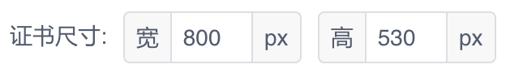

iView 的数字输入组件 InputNumber 大多数时候挺好用的，但是它满足不了下面样式的`单位数字`输入样式:



基于 Input 组件，很方便的就能实现一个，需要注意的地方是输入变化后的数字的解析。

```js
<!--
功能: 单位输入组件

属性:
value : 整数的输入值，可使用 v-model 双向绑定
prefix: 前缀
suffix: 后缀
min   : 最小值
max   : 最大值

事件:
on-change: 输入变化时触发

示例:
<InputUnit v-model="certificate.width" prefix="宽" suffix="px"/>
-->
<template>
    <div class="input-unit">
        <Input v-model="valueX" @on-blur="changeValue">
            <template v-if="prefix">
                <span slot="prepend">{{ prefix }}</span>
            </template>
            <template v-if="suffix">
                <span slot="append">{{ suffix }}</span>
            </template>
        </Input>
    </div>
</template>

<script>
export default {
    props: {
        value : { type: Number, required: true }, // 输入的值
        prefix: { type: String, default: '' },    // 前缀
        suffix: { type: String, default: '' },    // 后缀
        min   : { type: Number, default: 0 },     // 最大值
        max   : { type: Number, default: 100 },   // 最小值
    },
    model: {
        prop : 'value',
        event: 'on-change',
    },
    data() {
        return {
            valueX: this.clamp(this.value),
        };
    },
    methods: {
        // 限制 v 值在 min 和 max 之间
        clamp(v) {
            v = Math.max(v, this.min);
            v = Math.min(v, this.max);

            return v;
        },
        changeValue() {
            // 需要在下一个事件循环中处理，保证修改生效
            this.$nextTick(() => {
                this.valueX = parseInt(this.valueX) || 0;
                this.valueX = this.clamp(this.valueX);

                this.$emit('on-change', this.valueX);
            });
        },
    },
    watch: {
        // 组件外修改 value 时更新输入框
        value(n, o) {
            this.valueX = this.clamp(n);
        },
        // 输入框中的输入变化时更新父组件中的 value
        valueX(n, o) {
            // 向后删除为空的时候不处理，避免为空时解析为 0 造成输入不便
            if (n) {
                this.changeValue();
            }
        }
    }
};
</script>

<style lang="scss">
.input-unit {
    display: inline-block;
}
</style>
```

