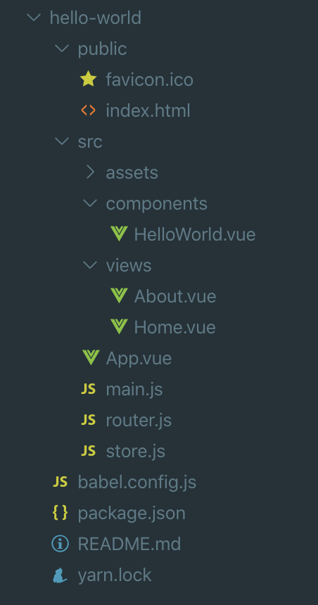

第一步先学习使用 Vue-Cli 创建一个单页的项目，但是 Vue-Cli 有几个版本，经过比较，[Vue-Cli 3](https://cli.vuejs.org/zh/) 相比以前的版本有更多的优点: 

* 项目结构更加清晰简洁
* 运行效率更高
* 打包速度更快、包更小
* 原生支持创建多页项目
* 支持 yarn 进行包管理
* 支持 Webpack 4 

等等, 决定选择 Vue-Cli 3 来创建项目，下面就简要的介绍使用 Vue-Cli 3 创建单页项目的步骤:

1. 安装 yarn, 可参考 [Yarn 新手指南](https://yarnpkg.com/lang/zh-hans/docs/cli/add/) (也可以使用 npm)
   * yarn 安装项目依赖: `yarn add package-name [--dev/-D]`
   * yarn 升级项目依赖: `yarn upgrade package-name`
   * yarn 安装全局依赖: `yarn global add package-name`
   * yarn 删除项目依赖: `yarn remove package-name`
   
2. [安装 Vue-Cli 3](https://cli.vuejs.org/zh/guide/installation.html): `yarn global add @vue/cli`
3. 使用 Vue-Cli 3 创建项目:
   * 启动项目管理页面: `vue ui`
   * 选择项目所在目录，输入项目名称 `hello-world`
   * 选择 yarn 作为包管理器
   * 选择需要的插件, 推荐
     * Babel
     * Router
     * Vuex
     * Css Pre-processors (推荐 Scss)
     * Linter/Formatter (推荐 Airbnb)
     * 点击创建项目，等一会提示项目创建成功，生成的项目结构如下:

      

4. 根据项目规范修改 eslint rules (在 package.json 文件里): 例如使用 4 个空格缩进, 代码中可以允许有多个空格进行排版, 更多的规则请根据项目的规范自行定制:

   ```js
   "rules": {
       "vue/no-reserved-keys": "warning",
       "indent": ["error", 4],
       "no-multi-spaces": 0
   }
   ```

5. 修改运行端口，默认端口是 8080 (修改 `vue.config.js`, 在项目根目录下, 没有的话自行创建)。因为我们是 Javaer，同时也要开发后端，8080 端口已经被 Tomcat 占用，所以需要把 Vue 项目的端口修改为其他端口, 例如修改为 8888:

   ```js
   module.exports = {
       devServer: {
           port: 8888,
       },
   };
   ```

   更多配置请参考 <https://cli.vuejs.org/zh/config/>

6. 运行: `yarn serve`
7. 打包: `yarn build`
   默认输出目录为项目根路径下 dist 目录, 可以修改 outputDir 进行指定:

   ```js
   module.exports = {
       devServer: {
           port: 8888,
       },
       outputDir: '../static',
   };
   ```

8. 安装 iView: 
   * 运行 `vue ui` 
   * 搜索插件 `vue-cli-plugin-iview`，点击安装
   * 等一会，安装完成后 `main.js` 中自动增加了使用 iView 的语句 `import './plugins/iview'`

10. 打包分析: `yarn build --report`，会生成的报告 `report.html`
11. App.vue: 是页面的顶层容器，所有页面的内容都会显示在它里面，但是 App.vue 不走路由，推荐修改为:

    ```html
    <template>
        <div id="app">
            <router-view/>
        </div>
    </template>
    
    <style lang="scss">
    body, html, #app {
        width: 100%;
        height: 100%;
        min-width: 960px;
        padding: 0;
        margin: 0;
        background: white;
        font-family: Helvetica, "Microsoft YaHei", Arial, sans-serif;
        -webkit-font-smoothing: antialiased;
        -moz-osx-font-smoothing: grayscale;
    }
    </style>
    ```

    > 注意: 它不是路径 `/` 对应的页面，`/` 的页面也是显示到 `<router-view/>`。

12. 在 router.js 中配置不存在的路由都访问 404.vue (自己创建吧):

    ```js
    import Vue from 'vue';
    import Router from 'vue-router';
    import Home from './views/Home.vue';
    
    Vue.use(Router);
    
    export default new Router({
        routes: [
            {
                path: '/',
                name: 'home',
                component: Home,
            },
            {
                path: '/about',
                name: 'about',
                component: () => import(/* webpackChunkName: "about" */ './views/About.vue'),
            },
            {
                // 不存在的路由都显示 404 页面
                path: '*',
                component: () => import(/* webpackChunkName: "common" */ './views/404.vue'),
            }
        ],
    });
    ```

到此，就完成了一个单页项目的创建，接下来在此基础上把单页项目修改为多页项目。