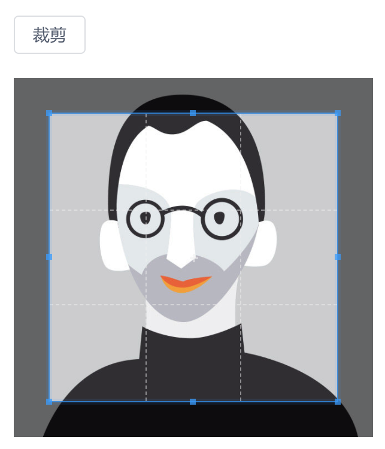

上传头像时一般需要能够对图片进行裁剪，让用户选择满意的部分作为头像，浏览器端裁剪图片的库有不少，[cropperjs](https://github.com/fengyuanchen/cropperjs) 比较简单好用，在 PC 浏览器和手机浏览器里都很流畅，是个不错的选择，下面就介绍 cropperjs 的简单使用，实现下面的效果:



更详细的说明请参考官方文档。

```html
<template>
    <div class="about">
        <Button @click="crop">裁剪</Button>

        <!-- [1] 把要裁剪的图片显示在 img 上，并且 img 放在一个具有大小的容器中 -->
        <div style="width: 300px; height: 300px; margin: 20px 0">
            
        </div>
        
        <!-- 显示裁剪后的图片 -->
        
    </div>
</template>

<script>
// [2] 引入 cropper 的 js 和 css
import 'cropperjs/dist/cropper.css';
import Cropper from 'cropperjs';

export default {
    data() {
        return {
            cropper: null,
        };
    },
    mounted() {
        // [3] 初始化 cropper
        const image = document.getElementById('srcImg');
        this.cropper = new Cropper(image, { aspectRatio: 1 / 1, viewMode: 3 });
    },
    methods: {
        crop() {
            // [4] 获取裁剪的图片数据
            // A. toDataURL() 得到字符串格式的图片 src 方便显示
            // B. toBlob() 得到 blob 格式的图片方便上传到服务器

            this.cropper.getCroppedCanvas().toBlob((blob) => {
                console.log(blob);
            });

            this.$refs.dstImg.src = this.cropper.getCroppedCanvas().toDataURL('image/jpeg');
        }
    }
};
</script>

<style lang="scss">
.about {
    img {
        /* 图片不要超过容器的尺寸 */
        max-width: 100%;
    }
}
</style>
```

