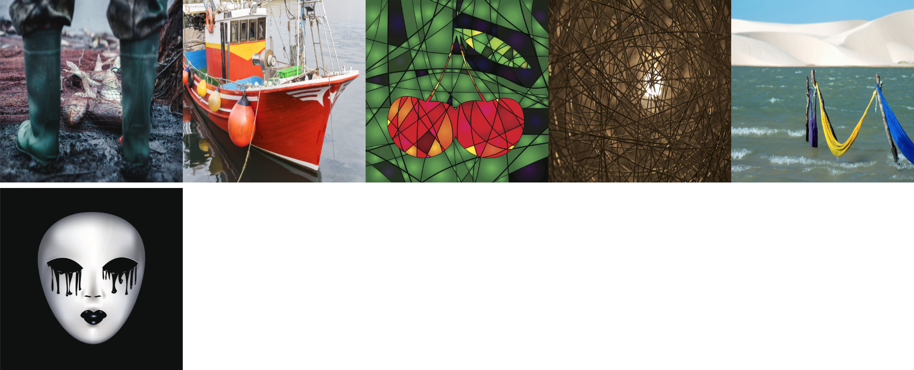
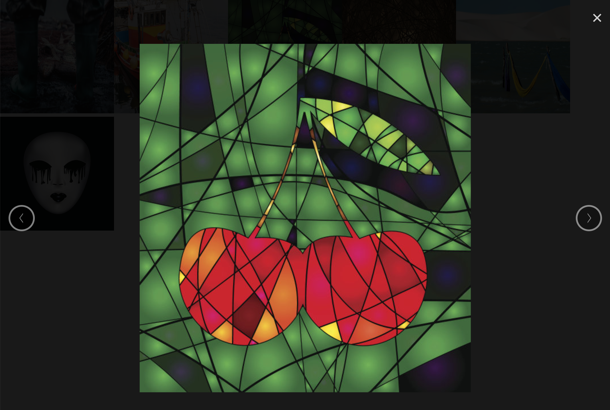

使用组件 [vue-gallery](https://github.com/RobinCK/vue-gallery) 实现图片预览效果，效果可参考 [Live Demo](https://fiddle.jshell.net/Robin_ck/LffrLb2k/show/light/)。

## 添加依赖

```js
yarn add vue-gallery
```

## 使用案例

实现步骤:

1. 引入组件 Gallery
2. 注册组件 Gallery
3. 准备图片数据，可以后期动态添加
4. 页面上显示图片，点击后显示预览大图
5. 使用 Gallery

```js
<template>
    <div>
        <!-- [4] 页面上显示图片，点击后显示预览大图 -->
        <div class="thumnails">
            
        </div>

        <!-- [5] 点击页面上的图片后显示大图的 Gallery -->
        <Gallery :images="images" :index="galleryImageIndex" @close="galleryImageIndex = null"/>
    </div>
</template>

<script>
import Gallery from 'vue-gallery'; // [1] 引入组件 Gallery

export default {
    components: {
        Gallery // [2] 注册组件 Gallery
    },
    data() {
        return {
            galleryImageIndex: -1, // Gallery 中当前显示的图片的下标
            images: [ // [3] 准备图片数据，可以后期动态添加
                'https://goss.veer.com/creative/vcg/veer/612/veer-300416794.jpg',
                'https://goss.veer.com/creative/vcg/veer/612/veer-301049438.jpg',
                'https://goss.veer.com/creative/vcg/veer/612/veer-168763769.jpg',
                'https://goss.veer.com/creative/vcg/veer/612/veer-129737258.jpg',
                'https://goss.veer.com/creative/vcg/veer/612/veer-125908355.jpg',
                'https://goss.veer.com/creative/vcg/veer/612/veer-134700985.jpg',
            ]
        };
    }
};
</script>

<style lang="scss">
.thumnails {
    img {
        width : 200px;
        height: 200px;
    }
}
</style>
```

> 提示：右上角的关闭按钮是一个字母 X，可以自定义样式，先把 font-size 设置为 0，然后定义宽高和背景图片。





上面的例子比较简单，例如考试的每个题目都有可能有回答的图片，不能每个题目都给创建一个 Gallery 组件，而是共享一个 Gallery，只需要把所有需要进行大图预览的图片都放入 Gallery 使用的图片数组即可，唯一需要注意的是点击图片的时候需要使用图片的路径在 Gallery 的图片数组中查到对应的下标:

```js
<template>
    <div>
        <!-- [4] 页面上显示图片，点击后显示预览大图 -->
        <div class="thumbnails">
            
        </div>
        <div class="thumbnails">
            
        </div>

        <!-- [5] 点击页面上的图片后显示大图的 Gallery -->
        <Gallery :images="galleryImages" :index="galleryImageIndex" @close="galleryImageIndex = null"/>
    </div>
</template>

<script>
import Gallery from 'vue-gallery'; // [1] 引入组件 Gallery

export default {
    components: {
        Gallery // [2] 注册组件 Gallery
    },
    data() {
        return {
            galleryImageIndex: -1, // Gallery 中当前显示的图片的下标
            galleryImages: [],
            images1: [ // [3] 准备图片数据，可以后期动态添加
                'https://goss.veer.com/creative/vcg/veer/612/veer-300416794.jpg',
                'https://goss.veer.com/creative/vcg/veer/612/veer-301049438.jpg',
                'https://goss.veer.com/creative/vcg/veer/612/veer-168763769.jpg',
            ],
            images2: [ // [3] 准备图片数据，可以后期动态添加
                'https://goss.veer.com/creative/vcg/veer/612/veer-129737258.jpg',
                'https://goss.veer.com/creative/vcg/veer/612/veer-125908355.jpg',
                'https://goss.veer.com/creative/vcg/veer/612/veer-134700985.jpg',
            ]
        };
    },
    created() {
        // [*] 把所有需要使用 Gallery 预览的图片的路径都加入 galleryImages
        this.galleryImages.push(...this.images1);
        this.galleryImages.push(...this.images2);
    },
    methods: {
        // [*] 点击图片的时候显示大图
        showImage(src) {
            const index = this.galleryImages.indexOf(src);

            if (-1 !== index) {
                this.galleryImageIndex = index;
            }
        }
    }
};
</script>

<style lang="scss">
.thumbnails {
    img {
        width: 200px;
        height: 200px;
    }
}
</style>
```

