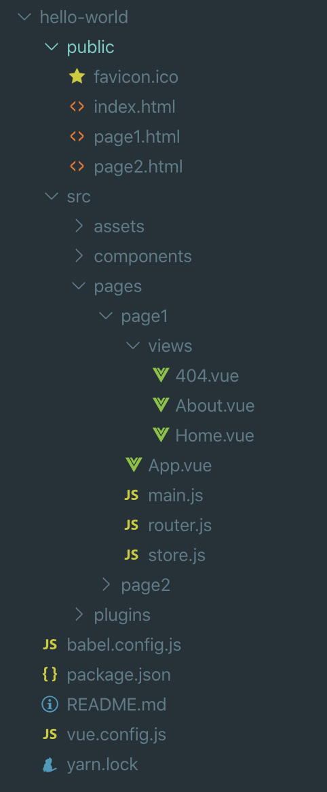

了解怎么创建 Vue 的单页项目后，在它的基础上就能很简单的把它修改为多页项目 (可参考[官方文档](https://cli.vuejs.org/zh/config/#pages))。

## 创建步骤

在单页结构的基础上进行创建:

1. 创建目录 `src/pages/page1`, `src/pages/page2` (每个目录表示一个单页)

2. 修改 main.js 中 `import './plugins/iview'` 为 `import '@/plugins/iview'`

3. 把 `App.vue`, `main.js`, `router.js`, `store.js`, `views 目录`等都分别复制一份到 page1 和 page2 目录 (然后就不需要它们了，删除即可)

4. 修改 vue.config.js 中的 `exports.pages`, 配置每个单页的入口 (page1, page2 就是单页访问地址):

   ```js
   module.exports = {
       devServer: {
           port: 8888,
       },
       pages: {
           page1: 'src/pages/page1/main.js',
           page2: 'src/pages/page2/main.js',
       },
       ...
   }
   ```

5. 复制 `public/index.html` 为 `public/page1.html` 和 `public/page2.html`

6. 启动: `yarn serve`

7. 访问页面:

   * <http://localhost:8888/page1>
   * <http://localhost:8888/page2>

## 目录结构



如果想要再创建一个页面名为 foo，按照下面的步骤即可:

* 复制 `pages/page1` 文件夹并命名为 `pages/foo`
* vue.config.js 中 `pages` 增加 `foo: 'src/pages/foo/main.js'`
* 复制 `public/page1.html` 为 `public/foo.html`

## 思考

**为什么每个页面都要在 public 目录下有一个对应的 html 文件 (名字的模式为 `${subpage}.html`)?**

因为我们的设计为不同的用户访问不同的页面，也就是有的用户的功能复杂，有的简单，可能需要使用不同的第三方库，为了针对不同的用户引入不同的第三方库文件，特此为不同的页面定义各自的 html 文件。如果一个页面没有找到自己的 html 文件，则会使用 index.html。