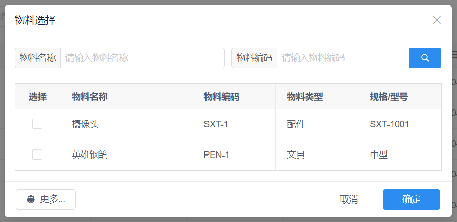

很多时候需要在弹出的对话框里输入搜索条件，对搜索到的结果进行选择，效果如下图，上面部分是搜索条件，中间是搜索结果，左下角为加载更多按钮，右下角为取消确定按钮:



于是我们在前面弹窗组件的基础上进行封装，提供统一的实现模板代码。

```html
<!-- eslint-disable vue/no-parsing-error -->
<!--
功能: 产品项选择弹窗

属性:
visible: 是否可见，可使用 v-model 双向绑定

事件:
on-ok: 点击确定时触发，参数为选择的产品项
on-visible-change: 显示或隐藏时触发，显示时参数为 true，隐藏时为 false

案例:
<ProductItemSelect v-model="visible"/>
-->

<template>
    <Modal :value="visible" title="物料选择" :mask-closable="false" transfer width="700" class="product-item-select-modal" @on-visible-change="showEvent">
        <!-- 弹窗 Body -->
        <div class="list-page">
            <!-- 搜索条件 -->
            <div class="list-page-toolbar-top">
                <Input v-model="filter.name" placeholder="请输入物料名称" @on-enter="searchProductItems">
                    <span slot="prepend">物料名称</span>
                </Input>
                <Input v-model="filter.code" placeholder="请输入物料编码" search enter-button @on-search="searchProductItems">
                    <span slot="prepend">物料编码</span>
                </Input>
            </div>

            <!-- 物料列表 -->
            <Table :data="items" :columns="columns" :loading="reloading" border>
                <!-- 操作按钮 -->
                <template slot-scope="{ row: item, index }" slot="action">
                    <Checkbox :value="item.productItemId === itemSelected.productItemId" @on-change="selectItem(index, $event)"></Checkbox>
                </template>
            </Table>
        </div>

        <!-- 底部工具栏 -->
        <div slot="footer">
            <Button v-show="more" :loading="loading" icon="md-boat" style="float: left" @click="fetchMoreProductItems">更多...</Button>
            <Button type="text" @click="showEvent(false)">取消</Button>
            <Button type="primary" @click="ok">确定</Button>
        </div>
    </Modal>
</template>

<script>
import ProductDao from '@/../public/static-p/js/dao/ProductDao';

export default {
    props: {
        visible: { type: Boolean, required: true }, // 是否可见
    },
    model: {
        prop : 'visible',
        event: 'on-visible-change',
    },
    data() {
        return {
            items: [],
            itemSelected: {}, // 选中的 item
            filter: { // 搜索条件
                name      : '',
                code      : '',
                pageSize  : 10,
                pageNumber: 1,
            },
            more     : false, // 是否还有更多物料
            loading  : false, // 加载中
            reloading: false, // 重新加载中
            columns  : [
                // 设置 width, minWidth，当大小不够时 Table 会出现水平滚动条
                { slot: 'action', title: '选择', width: 70, align: 'center' },
                { key : 'name',   title: '物料名称' },
                { key : 'code',   title: '物料编码', width: 130 },
                { key : 'type',   title: '物料类型', width: 130 },
                { key : 'model',  title: '规格/型号', width: 130 },
            ],
        };
    },
    methods: {
        // 显示隐藏事件
        showEvent(visible) {
            this.$emit('on-visible-change', visible);

            // 显示弹窗时 visible 为 true，初始化
            if (visible) {
                this.init();
            }
        },
        // 点击确定按钮的回调函数
        ok() {
            if (!this.itemSelected.productItemId) {
                this.$Message.warning('请选择物料');
                return;
            }

            this.itemSelected.count = 1;
            this.$emit('on-ok', this.itemSelected);
            this.showEvent(false); // 关闭弹窗
        },
        // 初始化
        init() {
            this.itemSelected = {};
            this.searchProductItems();
        },
        // 搜索物料
        searchProductItems() {
            this.items             = [];
            this.more              = false;
            this.reloading         = true;
            this.filter.pageNumber = 1;

            this.fetchMoreProductItems();
        },
        // 点击更多按钮加载下一页的物料
        fetchMoreProductItems() {
            this.loading = true;

            ProductDao.findProductItems(this.filter).then(items => {
                this.items.push(...items);

                this.more      = items.length >= this.filter.pageSize;
                this.loading   = false;
                this.reloading = false;
                this.filter.pageNumber++;
            });
        },
        // 选择物料
        selectItem(index, selected) {
            if (selected) {
                this.itemSelected = this.items[index];
            } else {
                this.itemSelected = {};
            }
        }
    }
};
</script>

<style lang="scss">
.product-item-select-modal {
    .list-page-toolbar-top {
        grid-template-columns: 1fr 1fr;
        grid-gap: 10px;
    }

    .ivu-checkbox-wrapper {
        margin-right: 0;
    }
}
</style>
```

