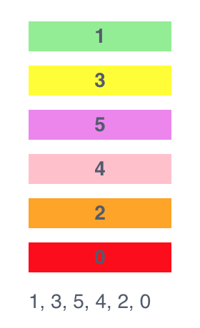
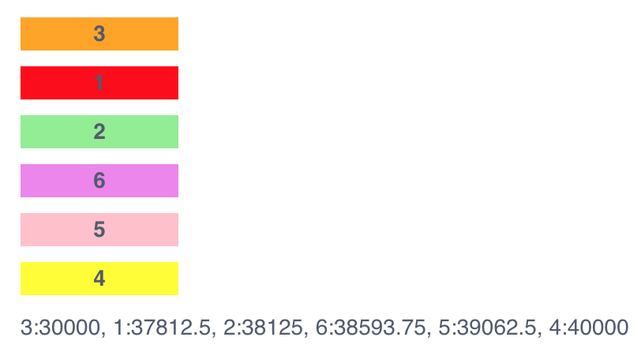

例如有一个多行的信息列表，需要调整信息的位置，一种方案是在每一行增加`上移`和`下移`的按钮，点击按钮进行移动，更友好的交互体验是通过拖拽进行移动，HTML5 原生支持拖拽，借助 Sortable 实现起来更简单。



## 基础示例

[Sortable](https://github.com/SortableJS/Sortable) is a JavaScript library for reorderable drag-and-drop lists，下面介绍和 Vue 的简单集成:

1. 添加依赖: `yarn add sortablejs`
2. 页面中引入 Sortable: `import Sortable from 'sortablejs'`
3. HTML 中创建被拖拽的列表
4. 使用被拖拽的元素创建 Sortable 对象: `Sortable.create(element, config)`
5. onEnd 事件触发时，修改 Vue 管理的数据，与 Vue 集成最关键的是拖拽结束后需要手动修 Vue 管理的数据，Sortable 不会帮我们修改，具体请参考 `onEnd` 函数。<!--more-->

```js
<template>
    <div class="demo">
        <!-- [3] HTML 中创建被拖拽的列表 -->
        <ul id="items">
            <li v-for="item in items" :key="item">{{ item }}</li>
        </ul>
        {{ items.join(', ') }}
    </div>
</template>

<script>
// [2] 页面中引入 Sortable
import Sortable from 'sortablejs';

export default {
    data() {
        return {
            items: [0, 1, 2, 3, 4, 5],
            sortable: null,
        };
    },
    mounted() {
        const e = document.querySelector('#items');

        // [4] 使用被拖拽的元素创建 Sortable 对象
        this.sortable = Sortable.create(e, {
            animation: 150,
            // [5] onEnd 事件触发时，修改 Vue 管理的数据
            onEnd: (event) => {
                // 拖放结束时, 界面上 HTML 的元素交换了顺序，但是 vue 的 this.items 中的数据没有被改变，需要手动修改:
                // 1. 获取被拖拽的元素: oldIndex
                // 2. 删除被拖拽的元素: oldIndex
                // 3. 把被拖拽的元素插入新位置: newIndex
                const item = this.items[event.oldIndex];
                this.items.splice(event.oldIndex, 1);
                this.items.splice(event.newIndex, 0, item);
            }
        });

        // 给每一个 li 增加背景，方便拖拽时观察
        const COLORS = ['red', 'green', 'orange', 'yellow', 'pink', 'violet'];
        document.querySelectorAll('li').forEach((li, i) => {
            li.className = COLORS[i++];
        });
    },
    destroyed() {
        // 销毁 Sortable，否则当重复多次创建时导致拖拽无效
        this.sortable.destroy();
    },
};
</script>

<style lang="scss">
.demo {
    ul#items {
        list-style: none;

        li {
            margin-bottom: 10px;
            width: 100px;
            text-align: center;
            font-weight: bold;
        }
    }

    .red    { background: red; }
    .green  { background: green; }
    .orange { background: orange; }
    .yellow { background: yellow; }
    .pink   { background: pink; }
    .violet { background: violet; }
}
</style>
```

[Vue.Draggable](https://github.com/SortableJS/Vue.Draggable) is Vue drag-and-drop component based on Sortable.js，也可以直接使用这个组件 ，这样就不需要自己修改 Vue 管理的数据了。

## 增加序号

给数据项增加一个序号 `sn` (sequence number) 表示在列表中的位置，这样即使保存是无序的，只要按照序号进行排序就能够很容易的按顺序恢复列表。

大多数情况下 sn  用整数比较多，但是这里我们使用浮点数。如果 sn 用整数，改变一个数据项的位置后，所有数据项 sn 的值都可能需要改变，那么就需要对应的把数据库中这些项的 sn 都更新一次，也就是说改变一个项的位置，可能需要更新多个项的数据。如果 sn 用浮点数，改变位置的项的 sn 的值为它前后项的 sn 和的一半，数据库中只需要更新它自己的 sn 即可。



```js
<template>
    <div class="demo">
        <!-- [3] HTML 中创建被拖拽的列表 -->
        <ul id="items">
            <li v-for="item in items" :key="item.name+''">{{ item.name }}</li>
        </ul>
        {{ output }}
    </div>
</template>

<script>
// [2] 页面中引入 Sortable
import Sortable from 'sortablejs';

export default {
    data() {
        return {
            items: [ // sn 的间隔大一些，计算出的浮点数效果更好
                { name: 1, sn: 10000 },
                { name: 2, sn: 20000 },
                { name: 3, sn: 30000 },
                { name: 4, sn: 40000 },
                { name: 5, sn: 50000 },
                { name: 6, sn: 60000 },
            ],
        };
    },
    mounted() {
        const e = document.querySelector('#items');

        // [4] 使用被拖拽的元素创建 Sortable 对象
        Sortable.create(e, {
            animation: 150,
            // [5] onEnd 事件触发时，修改 Vue 管理的数据
            onEnd: (event) => {
                // 拖放结束时, 界面上 HTML 的元素交换了顺序，但是 vue 的 this.items 中的数据没有被改变，需要手动修改:
                // 1. 获取被拖拽的元素: oldIndex
                // 2. 删除被拖拽的元素: oldIndex
                // 3. 把被拖拽的元素插入新位置: newIndex
                // 4. 更新被拖拽元素的 sn
                // 5. 更新 this.items[newIndex].sn 到数据库

                const item = this.items[event.oldIndex];
                this.items.splice(event.oldIndex, 1);
                this.items.splice(event.newIndex, 0, item);

                // [4] 更新被拖拽元素的 sn
                this.items[event.newIndex].sn = this.calculateSn(event.newIndex);

                // TODO: [5] 更新 this.items[newIndex].sn 到数据库
            }
        });

        // 给每一个 li 增加背景，方便拖拽时观察
        const COLORS = ['red', 'green', 'orange', 'yellow', 'pink', 'violet'];
        document.querySelectorAll('li').forEach((li, i) => {
            li.className = COLORS[i++];
        });
    },
    methods: {
        // 计算 items[index] 项的 sn
        calculateSn(index) {
            // 如果 items 为空，返回 10000
            // 如果在第一个位置，那么 sn 为第二个 item 的 sn-10000
            // 如果在最后的位置，那么 sn 为倒数第二个 item 的 sn+10000
            // 如果在中间，那么 sn 为前后邻接的 items 的 sn 和的一半

            if (this.items.length === 0) { return 10000; }

            if (index === 0) {
                return this.items[1].sn - 10000;
            } else if (index === this.items.length - 1) {
                return this.items[this.items.length-2].sn + 10000;
            } else {
                return (this.items[index-1].sn + this.items[index+1].sn) / 2;
            }
        }
    },
    computed: {
        output() {
            return this.items.map(i => `${i.name}:${i.sn}`).join(', ');
        }
    }
};
</script>

<style lang="scss">
.demo {
    ul#items {
        list-style: none;

        li {
            margin-bottom: 10px;
            width: 100px;
            text-align: center;
            font-weight: bold;
        }
    }

    .red    { background: red; }
    .green  { background: lightgreen; }
    .orange { background: orange; }
    .yellow { background: yellow; }
    .pink   { background: pink; }
    .violet { background: violet; }
}
</style>
```

## 禁止 Drag And Drop

符合条件才允许 Drop，例如已经存在了就不要再次添加，可参考 [Cancel drop](https://github.com/SortableJS/sortablejs/issues/264#issuecomment-269674883):

```js
Sortable.create(formula_options_list, {
     group: {
          name: 'optionslist',
          pull: function (to, from) {
               return from.el.children.length > 1; // 返回 true 允许 Drag
          }
     },
     animation: 150
});
						
Sortable.create(formula_preview_list, {
     group: {
          name: 'previewlist',
          put: function (to) {
               return to.el.children.length < 5; // 返回 false 不允许 Drop，返回 true 允许 Drop
          }
     },
     animation: 150
});
```

请参考 [Group 的介绍](https://segmentfault.com/a/1190000008209715) 和 [Sortable.js 的研究](https://zhuanlan.zhihu.com/p/98595327):

```js
string: 命名，个人建议用元素 id 就行, 用处是为了设置可以拖放容器时使用，在 Object 中的 put 的设置中再做介绍；
object: { name, pull, put }
        name: 同 string 的方法，
        pull: 用来定义从这个列表容器移动出去的设置，true/false/'clone'/function
            true: 列表容器内的列表单元可以被移出；
            false: 列表容器内的列表单元不可以被移出；
            'clone': 列表单元移出，移动的为该元素的副本；
            function: 用来进行 pull 的函数判断，可以进行复杂逻辑，在函数中 return false/true 来判断是否移出；
        put: 用来定义往这个列表容器放置列表单元的的设置，true/false/['foo','bar']/function
            true: 列表容器可以从其他列表容器内放入列表单元；
            false: 与 true 相反；
            ['foo','bar']: 这个可以是一个字符串或者是字符串的数组，代表的是 group 配置项里定义的 name 值；
            function: 用来进行 put 的函数判断，可以进行复杂逻辑，在函数中 return false/true 来判断是否放入；
```

