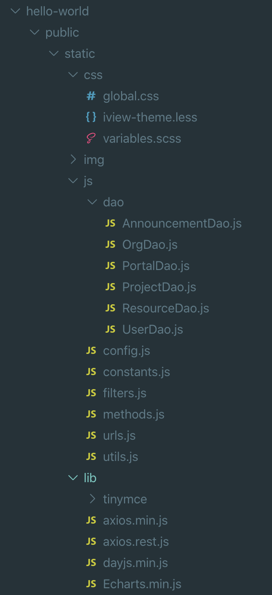

规范对于项目管理至关重要，大家都要遵循统一的规范进行开发，而不是自由的发挥，我们对于不同作用的文件进行了约束:

| 文件                       | 说明                                                         |
| -------------------------- | ------------------------------------------------------------ |
| static/js/`utils.js`       | 一些常用的功能，例如字符串格式化、日期格式化、增强 Array 等  |
| static/js/`urls.js`        | 所有和服务器交互的接口的 URL 都统一在此文件中定义，方便管理  |
| static/js/`constants.js`   | 在此定义常量                                                 |
| static/js/`filters.js`     | Vue 的全局过滤器                                             |
| static/js/`methods.js`     | Vue.prototype 的原型函数                                     |
| static/js/dao/`XxxDao.js`  | 与服务器交互的代码在 dao 中实现，页面中调用 dao 和服务器交互，页面中只关心数据，不关心交互细节 |
| static/css/`global.css`    | 全局样式                                                     |
| static/css/`varibles.scss` | SCSS 变量和 mixin                                            |
| static/img/`xxx.png`       | 图片存放，不同用途的图片建议分目录管理                       |
| static/`lib`               | 存放第三方库，例如 Dayjs, Axios, Echarts 等                  |



以下列举了各类文件的写法，更多的内容需要大家在开发过程中补充。

## utils.js

一些常用的功能，例如字符串格式化、日期格式化、增强 Array 等。

```js
function Utils() {}

/**
 * 从 100 开始生成新的 ID。
 *
 * @return {String} 返回页面打开后按顺序生成的 ID
 */
Utils.nextId = function() {
    window.newGeneratedId = window.newGeneratedId || 99;
    window.newGeneratedId += 1;

    return window.newGeneratedId + '';
};

/**
 * 从数组中删除下标为 index 的元素
 *
 * @param  {Integer} index 要删除的元素的下标
 * @return 无返回值
 */
Array.prototype.remove = function(index) {
    this.splice(index, 1);
};

/**
 * 在下标为 index 处向数组中插入一个元素，例如 arr.remove(2)
 *
 * @param  {Integer}     index 要插入元素的位置
 * @param  {ElementType} elem  要插入的元素
 * @return 无返回值
 */
Array.prototype.insert = function(index, elem) {
    this.splice(index, 0, elem);
};

/*-----------------------------------------------------------------------------|
 |                                 字符串格式化                                  |
 |----------------------------------------------------------------------------*/
/**
 * 扩展了 String 类型，给其添加格式化的功能，替换字符串中 {placeholder} 或者 {0}, {1} 等模式部分为参数中传入的字符串
 * 使用方法:
 *     'I can speak {language} since I was {age}'.format({language: 'Javascript', age: 10})
 *     'I can speak {0} since I was {1}'.format('Javascript', 10)
 * 输出都为:
 *     I can speak Javascript since I was 10
 *
 * @param replacements 用来替换 placeholder 的 JSON 对象或者数组
 */
String.prototype.format = function(replacements) {
    replacements = (typeof replacements === 'object') ? replacements : Array.prototype.slice.call(arguments, 0);
    return formatString(this, replacements);
};

/**
 * 替换字符串中 {placeholder} 或者 {0}, {1} 等模式部分为参数中传入的字符串
 * 使用方法:
 *     formatString('I can speak {language} since I was {age}', {language: 'Javascript', age: 10})
 *     formatString('I can speak {0} since I was {1}', 'Javascript', 10)
 * 输出都为:
 *     I can speak Javascript since I was 10
 *
 * @param str 带有 placeholder 的字符串
 * @param replacements 用来替换 placeholder 的 JSON 对象或者数组
 */
var formatString = function(str, replacements) {
    replacements = (typeof replacements === 'object') ? replacements : Array.prototype.slice.call(arguments, 1);
    return str.replace(/\{\{|\}\}|\{(\w+)\}/g, function(m, n) {
        if (m === '{{') { return '{'; }
        if (m === '}}') { return '}'; }
        return replacements[n];
    });
};
```

## urls.js

所有和服务器交互的接口的 URL 都统一在此文件中定义，方便管理。

```js
const Urls = {
    API_USERS       : '/api/users',                  // 所有用户
    API_USERS_BY_ID : '/api/users/{userId}',         // 指定 ID 的用户
    API_USER_CLAZZES: '/api/users/{userId}/clazzes', // 用户所报的班级
    API_ORGS        : '/api/orgs',         // 所有机构
    API_ORGS_BY_ID  : '/api/orgs/{orgId}', // 指定 ID 的机构
};
```

## constants.js

在此定义常量。

```js
// 题目类型
window.QUESTION_TYPE = {
    SINGLE_CHOICE  : 1, // 单选题
    MULTIPLE_CHOICE: 2, // 多选题
    TFNG           : 3, // 判断题: true(是), false(否), not given(未提及)
    FITB           : 4, // 填空题: fill in the blank
    ESSAY_QUESTION : 5, // 问答题
    COMPLEX        : 6, // 复合题
    DESCRIPTION    : 7, // 题型题 (大题分组、介绍)
};

// 题目类型 (value 在前，name 在后，好排版)
window.QUESTION_TYPES = [
    { value: 1, name: '单选题' },
    { value: 2, name: '多选题' },
    { value: 3, name: '判断题' },
    { value: 4, name: '填空题' },
    { value: 5, name: '问答题' },
    { value: 6, name: '复合题' },
];

// 学科
window.SUBJECTS = ['语文', '数学', '英语', '物理', '化学', '生物', '地理', '政治', '历史'];
```

## filters.js

Vue 的全局过滤器，独立章节进行介绍。

## methods.js

Vue.prototype 的原型函数，独立章节进行介绍。

## XxxDao.js

与服务器交互的代码在 dao 中实现，页面中调用 dao 和服务器交互，页面中只关系数据，不关心交互细节，独立章节进行介绍。

## global.css

全局样式。

```css
/* 滚动条样式，只支持 Webkit 内核浏览器，如 Chrome, Safari */
::-webkit-scrollbar {
    width:  5px;
    height: 5px;
}
::-webkit-scrollbar-track {
    background: #ddd;
}
::-webkit-scrollbar-thumb {
    background: #888;
}

/* 文件类型图标样式 */
.file-type-other {
    background-image: url(/static/img/file-type/other.png);
}
.file-type-png {
    background-image: url(/static/img/file-type/jpg.png);
}

/* 文本不换行显示 */
.nobreak {
    word-break: keep-all;
    white-space: nowrap;
}

/* 文本只显示在一行，溢出时显示三个小点: elide 是省略的意思 */
.elide {
    white-space: nowrap;
    text-overflow: ellipsis;
    overflow: hidden;
}
```

## varibles.scss

SCSS 变量和 mixin。

```css
$borderColor    : #dcdee2; // 边框
$separatorColor : #e8eaec; // 分割线
$backgroundColor: #f8f8f9; // 背景色
$disabledColor  : #c5c8ce; // 失效

// 水平和垂直居中
@mixin alignCenter {
    display        : flex;
    justify-content: center;
    align-items    : center;
}

// 水平居中
@mixin alignHCenter {
    display    : flex;
    align-items: center;
}

// 垂直居中
@mixin alignVCenter {
    display        : flex;
    flex-direction : column;
    justify-content: center;
}
```

