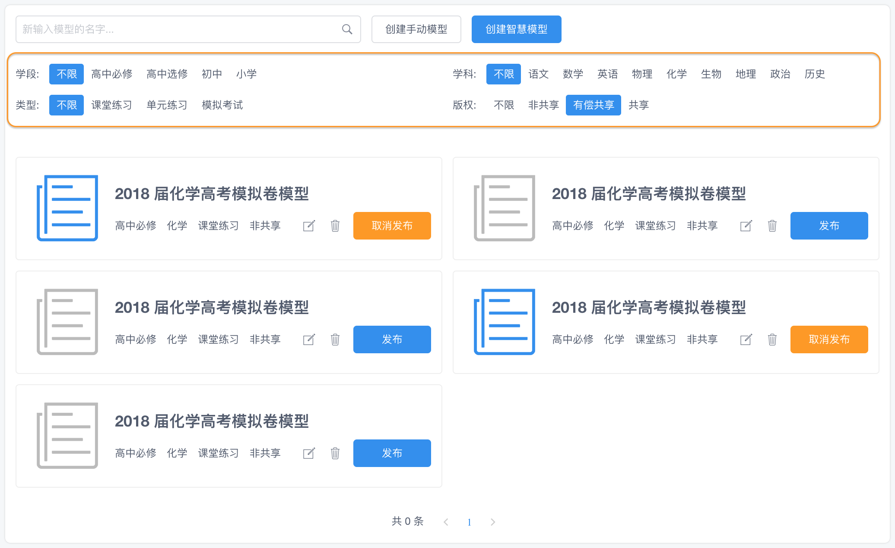

如图所示框中的条件选择，可以作为一个组件 `PaperFilter`:

* 使用 grid 布局
* 每个条件只能选择其中一个 (没有使用 Radio，因为样式不好看)
* 条件变化时发射信号 `on-change` 

```js
<!--
试卷条件选择过滤器

参数: 无

事件:
on-change(filter): 选择后触发，参数为过利器对象，有属性 phase, subject, type, copyright

案例:
<PaperFilter @on-change="filterChange"/>
-->
<template>
    <div class="paper-filter">
        <div>学段:</div>
        <div>
            <Button v-for="phase in phases" :key="phase" :type="buttonType(phase, filter.phase)" size="small" @click="filter.phase=phase">
                {{ phase || '不限' }}
            </Button>
        </div>

        <div>学科:</div>
        <div>
            <Button v-for="subject in subjects" :key="subject" :type="buttonType(subject, filter.subject)" size="small" @click="filter.subject=subject">
                {{ subject || '不限' }}
            </Button>
        </div>

        <div>类型:</div>
        <div>
            <Button v-for="type in types" :key="type" :type="buttonType(type, filter.type)" size="small" @click="filter.type=type">
                {{ type || '不限' }}
            </Button>
        </div>

        <div>版权:</div>
        <div>
            <Button v-for="copyright in copyrights" :key="copyright" :type="buttonType(copyright, filter.copyright)" size="small" @click="filter.copyright=copyright">
                {{ copyright || '不限' }}
            </Button>
        </div>
    </div>
</template>

<script>
export default {
    data() {
        return {
            filter: {
                phase    : '', // 学段
                subject  : '', // 学科
                type     : '', // 类型
                copyright: '', // 版权
            },
            phases    : ['', '高中必修', '高中选修', '初中', '小学'],
            subjects  : ['', '语文', '数学', '英语', '物理', '化学', '生物', '地理', '政治', '历史'],
            types     : ['', '课堂练习', '单元练习', '模拟考试'],
            copyrights: ['', '非共享', '有偿共享', '共享'],
        };
    },
    methods: {
        // 计算按钮的类型，a 等于 b 返回 primary，否则返回 text
        buttonType(a, b) {
            return a === b ? 'primary' : 'text';
        }
    },
    watch: {
        // 条件变化时发射信号 on-change
        filter: {
            deep: true,
            handler(newValue) {
                this.$emit('on-change', this.filter);
            }
        }
    }
};
</script>

<style lang="scss">
.paper-filter {
    display: grid;
    grid-template-columns: max-content 1fr max-content 1fr;
    grid-gap: 12px;
    align-items: center;

    button {
        margin-right: 6px;
    }
}
</style>
```

