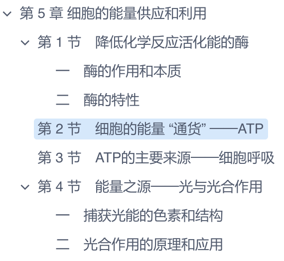
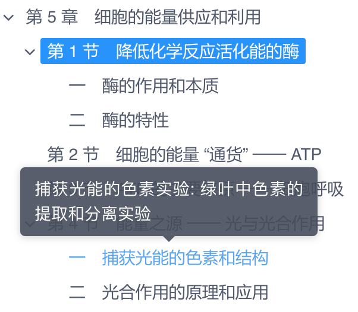

iView 的树形组件 [Tree](https://www.iviewui.com/components/tree-en) 提供了很多功能，但也满足不了各式各样的业务需求，好在可以很方便的对 Tree 进行自定义，以下为例:

* 点击不取消选中状态
* 恢复选中的节点
* 自定义节点样式
* 树的搜索

## 点击不取消选中状态

点击 Tree 的选中节点默认会取消选中状态，对于可以选择多个节点时这个功能没问题，但是只能选择一个节点的时候，我们希望点击选中的节点使得节点仍然是选中状态，只需要在 `on-select-change` 的函数中设置当前节点的 `selected` 为 true 即可:

```js
<template>
    <Tree :data="data" @on-select-change="selectChange"></Tree>
</template>

<script>
// 树的节点
let nodes = [{
    title: 'parent 1',
    expand: true,
    children: [
        {
            title: 'parent 1-1',
            expand: true,
            children: [
                { title: 'leaf 1-1-1' },
                { title: 'leaf 1-1-2' }
            ]
        },
        {
            title: 'parent 1-2',
            expand: true,
            children: [
                { title: 'leaf 1-2-1' },
                { title: 'leaf 1-2-1' }
            ]
        }
    ]
}];

export default {
    methods: {
        // 每次点击都会执行这个函数
        selectChange(selectedNodes, current) {
            current.selected = true; // 设置节点为选中状态
        }
    },
    data() {
        return {
            data: nodes,
        };
    }
};
</script>
```

## 恢复选中的节点

例如要显示如下的章节目录树，点击章节后编辑此章节的内容 (不在此实现)，希望再次打开页面时恢复展开到最后一次选中的章节继续工作。



假设从服务器得到的章节目录的数据如下，每个章节有唯一的编码 code:

```js
let chapters = [{
    code: '05',
    name: '第 5 章 细胞的能量供应和利用',
    children: [
        {
            code: '05-01',
            name: '第 1 节　降低化学反应活化能的酶',
            children: [
                { code: '05-01-01', name: '一　酶的作用和本质' },
                { code: '05-01-02', name: '二　酶的特性' }
            ],
        },
        { code: '05-03', name: '第 2 节　细胞的能量 “通货” ──ATP' },
        { code: '05-04', name: '第 3 节　ATP的主要来源──细胞呼吸' },
        {
            code: '05-05',
            name: '第 4 节　能量之源──光与光合作用',
            children: [
                { code: '05-05-01', name: '一　捕获光能的色素和结构' },
                { code: '05-05-02', name: '二　光合作用的原理和应用' }
            ],
        }
    ],
}];
```

需要考虑下面这些操作:

* 需要熟悉树结构的遍历操作，主要算法有深度优先和广度优先
* 显然这个数据结构不符合 Tree 的要求，需要预先处理后才能给 Tree 使用
* 为了能够方便的访问父章节节点，给每个章节的对象增加了 parent 属性
* 能够通过章节编码查找到 Tree 上对应的节点
* 点击章节后保存章节的编码 code 到 localStorage，页面刷新时从 localStorage 中读取章节编码，查找并展开此章节，直到展开到根节点

```js
<template>
    <Tree :data="chapters" @on-select-change="selectChange"></Tree>
</template>

<script>
// 从服务器获取到的章节目录数据
let chapters = [{
    code: '05',
    name: '第 5 章 细胞的能量供应和利用',
    children: [
        {
            code: '05-01',
            name: '第 1 节　降低化学反应活化能的酶',
            children: [
                { code: '05-01-01', name: '一　酶的作用和本质' },
                { code: '05-01-02', name: '二　酶的特性' }
            ],
        },
        { code: '05-03', name: '第 2 节　细胞的能量 “通货” ──ATP' },
        { code: '05-04', name: '第 3 节　ATP的主要来源──细胞呼吸' },
        {
            code: '05-05',
            name: '第 4 节　能量之源──光与光合作用',
            children: [
                { code: '05-05-01', name: '一　捕获光能的色素和结构' },
                { code: '05-05-02', name: '二　光合作用的原理和应用' }
            ],
        }
    ],
}];

export default {
    data() {
        return {
            chapters: [],
        };
    },
    mounted() {
        // 处理章节数据
        for (let chapter of chapters) {
            this.prepareChapters(chapter);
        }
        this.chapters = chapters;

        // 恢复最后一次选择的章节
        const code = localStorage.getItem('chapter-code');
        code && this.expandToChapter(code);
    },
    methods: {
        selectChange(selectedNodes, current) {
            console.log(current.title);
            current.selected = true;
            localStorage.setItem('chapter-code', current.code);
        },
        // 处理章节数据，以便能够在 Tree 中使用
        prepareChapters(chapter) {
            chapter.title    = chapter.name;
            chapter.expand   = false;
            chapter.selected = false;

            // 深度优先算法递归处理子章节
            chapter.children && chapter.children.forEach(child => {
                child.parent = chapter;
                this.prepareChapters(child);
            });
        },
        // 从根展开到编码为传入 code 的章节
        expandToChapter(code) {
            let chapter = this.findChapter(code);

            // 选中节点
            chapter && (chapter.selected = true);

            // 展开节点，展开直到根节点
            while (chapter) {
                chapter.expand = true;
                chapter = chapter.parent;
            }
        },
        // 查找编码为传入的 code 的章节
        findChapter(code) {
            const queue = [...this.chapters];

            // 广度优先算法进行查找
            while (queue.length > 0) {
                const chapter = queue.shift();

                if (chapter.code === code) {
                    return chapter;
                }

                chapter.children && queue.push(...chapter.children);
            }

            return null;
        },
    },
};
</script>
```

## 自定义节点样式

Tree 的文档中自定义节点样式使用 `render` 的语法看上去好复杂，我们不使用它，而是使用 JSX 的语法进行自定义节点，给 `desc` 不为空的节点显示 Tooltip 提示:



```js
<template>
    <Tree ref="tree" :data="chapters" :render="renderContent"/>
</template>

<script>
// 树的数据
let chapters = [{
    code: '05',
    title: '第 5 章　细胞的能量供应和利用',
    children: [
        {
            code: '05-01',
            title: '第 1 节　降低化学反应活化能的酶',
            children: [
                { code: '05-01-01', title: '一　酶的作用和本质', desc: '由活细胞产生的、对其底物具有高度特异性和高度催化效能的蛋白质或 RNA' },
                { code: '05-01-02', title: '二　酶的特性', desc: '酶具有高效率的催化能力' }
            ],
        },
        { code: '05-03', title: '第 2 节　细胞的能量 “通货” ── ATP' },
        { code: '05-04', title: '第 3 节　ATP 的主要来源 ── 细胞呼吸' },
        {
            code: '05-05',
            title: '第 4 节　能量之源 ── 光与光合作用',
            children: [
                { code: '05-05-01', title: '一　捕获光能的色素和结构', desc: '捕获光能的色素实验: 绿叶中色素的提取和分离实验' },
                { code: '05-05-02', title: '二　光合作用的原理和应用', desc: '光合作用，通常是指绿色植物（包括藻类）吸收光能，把二氧化碳和水合成富能有机物，同时释放氧气的过程' }
            ],
        }
    ],
}];

export default {
    data() {
        return {
            chapters: chapters,
        };
    },
    methods: {
        // 渲染树的节点
        renderContent(h, { root, node, data }) {
            // 节点 Element
            const content = <a
                data-id={ data.code }
                class={ this.nodeClass(root, node, data) }
                onClick={ () => this.clickNode(root, node, data) }
            >{ data.title }</a>;

            if (data.desc) {
                // 当 desc 不为空时显示 Tooltip 提示
                return (
                    <tooltip max-width="250" placement="top" transfer content={ data.desc }>
                        { content }
                    </tooltip>
                );
            } else {
                return content;
            }
        },
        // 节点的样式
        nodeClass(root, node, data) {
            return data.selected ? 'tree-node selected' : 'tree-node';
        },
        // 点击节点
        clickNode(root, node, data) {
            console.log(data.title);
            this.$set(data, 'expand', true);

            // 只选中当前点击的节点
            this.$refs.tree.getSelectedNodes().forEach(n => {
                this.$set(n, 'selected', false);
            });
            this.$set(data, 'selected', true);
        },
    },
};
</script>

<style lang="scss">
.tree-node {
    color: inherit;
    padding: 3px 6px;
    font-size: 14px;

    &.selected {
        background: #1e90ff;
        border-radius: 2px;
        color: white;
    }
}
</style>
```

当自定义节点后，Tree 的事件 `on-select-change` 不会再触发了，我们可以在点击节点的函数 `clickNode` 中执行希望的操作，自定义树的其他例子还可参考 [iView 使用 JSX render 树](https://qtdebug.com/fe-vue-tree/)。

## 树的搜索

如果树的节点非常多，要找到需要的节点会比较耗时，能够搜索查找目标节点有时候还是挺有用的。我们设计的搜索方式为从上往下搜索，只要找到一个 title 包含搜索关键字的节点就结束往下的深度搜索，这个节点加入树的一级节点，最终显示的树为一级节点的 title 都包含搜索的关键字，并且同时显示了这个节点的子节点。


```js
<template>
    <div class="foo">
        <Input v-model="keyword" suffix="ios-search" placeholder="请输入搜索条件" clearable/>
        <Tree ref="tree" :data="matchedChapters"/>
    </div>
</template>

<script>
// 树的数据
let chapters = [{
    code: '05',
    title: '第 5 章　细胞的能量供应和利用',
    children: [
        {
            code: '05-01',
            title: '第 1 节　降低化学反应活化能的酶',
            children: [
                { code: '05-01-01', title: '一　酶的作用和本质', desc: '由活细胞产生的、对其底物具有高度特异性和高度催化效能的蛋白质或 RNA' },
                { code: '05-01-02', title: '二　酶的特性', desc: '酶具有高效率的催化能力' }
            ],
        },
        { code: '05-03', title: '第 2 节　细胞的能量 “通货” ── ATP' },
        { code: '05-04', title: '第 3 节　ATP 的主要来源 ── 细胞呼吸' },
        {
            code: '05-05',
            title: '第 4 节　能量之源 ── 光与光合作用',
            children: [
                { code: '05-05-01', title: '一　捕获光能的色素和结构', desc: '捕获光能的色素实验: 绿叶中色素的提取和分离实验' },
                { code: '05-05-02', title: '二　光合作用的原理和应用', desc: '光合作用，通常是指绿色植物（包括藻类）吸收光能，把二氧化碳和水合成富能有机物，同时释放氧气的过程' }
            ],
        }
    ],
}];

export default {
    data() {
        return {
            chapters: chapters,
            keyword : '', // 搜索的关键字
        };
    },
    methods: {
        // 重置章节，取消选中状态，收拢展开的章节
        resetChapter(chapter) {
            this.$set(chapter, 'expand', false);
            this.$set(chapter, 'selected', false);

            chapter.children && chapter.children.forEach(child => {
                this.resetChapter(child);
            });
        },
        // 搜索匹配的章节，从上往下搜索，只要找到一个符合条件的章节，立即结束深度搜索，并放入 result 数组中
        // chapter: 当前正在搜索的章节
        // keyword: 用户输入的搜索关键字
        // result : 搜索到的章节数组
        findChapters(chapter, keyword, result) {
            // 章节的标题包含 word，则此章节为搜索到的章节
            if (chapter.title.includes(keyword)) {
                result.push(chapter);
                return;
            }

            // 深度搜索子章节
            chapter.children && chapter.children.forEach((child) => {
                this.findChapters(child, keyword, result);
            });
        },
    },
    computed: {
        // 匹配 keyword 的章节
        matchedChapters() {
            // 重置章节
            for (let chapter of this.chapters) {
                this.resetChapter(chapter);
            }

            // 关键字为空，返回完整的章节目录
            if (!this.keyword) {
                return this.chapters;
            }

            // 从一级的章节开始搜索
            let result = [];
            for (let chapter of this.chapters) {
                this.findChapters(chapter, this.keyword, result);
            }

            return result;
        }
    }
};
</script>

<style lang="scss">
.foo {
    padding: 20px;
    width: 400px;
}
.tree-node {
    color: inherit;
    padding: 3px 6px;
    font-size: 14px;

    &.selected {
        background: #1e90ff;
        border-radius: 2px;
        color: white;
    }
}
</style>
```

