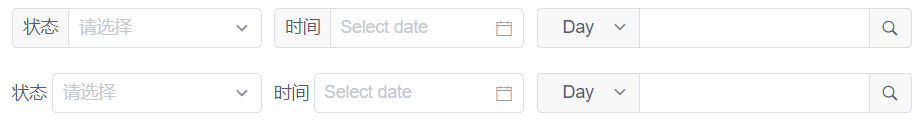

下图展示了 2 种风格的搜索过滤表单:



使用了 Select，DatePicker 和 Input 3 种组件，其中 Input 提供了 **prepend slot** 方便的在其前面增加 label、按钮或者复杂的组件如下拉选择框等，但是 Select 和 DatePicker 没有相关的 slot。

## 上部风格

为了设计风格统一，使用上部的这种风格，但又不想重新实现相关组件，简单的实现的方式为:

* 把标签值定义为组件的属性值 **data-prepend-label**
* 给此组件增加类 **prepend-label**
* 借助 CSS 中使用函数 `attr()` 可以访问元素属性的特性，把 label 渲染为 `::before` 伪元素

这样的好处是 CSS 定义一次即可 (例如放到全局样式文件)，而组件的标签则可以根据需要给定，且布局也很简单:

```html
<div class="filter-1">
    <!-- Select 增加 Label -->
    <Select data-prepend-label="状态" class="prepend-label">
        <Option label="失败" value="1"></Option>
        <Option label="成功" value="2"></Option>
    </Select>

    <!-- DatePicker 增加 Label -->
    <DatePicker data-prepend-label="时间" class="prepend-label" type="date" placeholder="Select date"></DatePicker>

    <!-- 原生 Input -->
    <Input>
        <Select v-model="select" slot="prepend" style="width: 80px">
            <Option value="day">Day</Option>
            <Option value="month">Month</Option>
        </Select>
        <Button slot="append" icon="ios-search"></Button>
    </Input>
</div>
```

```css
.filter-1 {
    display: grid;
    grid-template-columns: 200px 200px 300px;
    grid-gap: 10px;
}

.prepend-label {
    display: flex;
    position: relative;

    &::before {
        content: attr(data-prepend-label);
        padding: 0px 8px;
        border: 1px solid rgb(220, 222, 226);
        border-right: none;
        border-radius: 4px 0 0 4px;
        background-color: #f8f8f9;
        display: flex;
        align-items: center;
        white-space: nowrap;
        padding-bottom: 2px;
    }

    .ivu-select-selection, .ivu-date-picker-rel input {
        border-top-left-radius: 0;
        border-bottom-left-radius: 0;
        flex: 1;
    }
}
```

## 下部风格

下部风格的实现代码一般如下，没有什么特别的技巧，就是布局麻烦了点:

```html
<div class="filter-2">
    <div>
        <span>状态</span>
        <Select>
            <Option label="失败" value="1"></Option>
            <Option label="成功" value="2"></Option>
        </Select>
    </div>

    <div>
        <span>时间</span>
        <DatePicker type="date" placeholder="Select date"></DatePicker>
    </div>

    <Input>
        <Select v-model="select" slot="prepend" style="width: 80px">
            <Option value="day">Day</Option>
            <Option value="month">Month</Option>
        </Select>
        <Button slot="append" icon="ios-search"></Button>
    </Input>
</div>
```

```css
.filter-2 {
    display: grid;
    grid-template-columns: 200px 200px 300px;
    grid-gap: 10px;
    margin-bottom: 20px;

    > div:not(:last-child) {
        display: flex;
        grid-template-columns: max-content 1fr;
        grid-gap: 4px;
        align-items: center;

        > span {
            white-space: nowrap;
        }
    }
}
```

## 思考

如果要给 InputNumber 也实现同样的功能呢，如下使用:

```html
<InputNumber data-prepend-label="数量" class="prepend-label"></InputNumber>
```

下面是参考代码:

```css
.prepend-label {
    display: flex;
    position: relative;

    &::before {
        content: attr(data-prepend-label);
        padding: 0px 8px;
        border: 1px solid rgb(220, 222, 226);
        border-right: none;
        border-radius: 4px 0 0 4px;
        background-color: #f8f8f9;
        display: flex;
        align-items: center;
        white-space: nowrap;
        padding-bottom: 2px;
    }

    .ivu-select-selection, .ivu-date-picker-rel input {
        border-top-left-radius: 0;
        border-bottom-left-radius: 0;
        flex: 1;
    }

    /* 处理 InputNumber */
    &.ivu-input-number {
        width: 100%;

        &::before {
            border: none;
            border-right: 1px solid rgb(220, 222, 226);
            padding-bottom: 0px;
        }
    }
}
```

