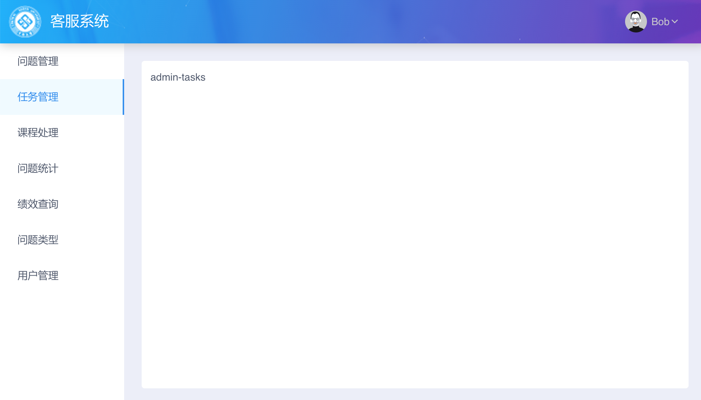

如下图的菜单，管理员能够访问所有的菜单项，普通用户只能访问最上面的 3 个菜单项，由于前面 3 个菜单项的功能完全一样，如果还是针对不同的角色各开发一个单页，就有点重复劳动了，此时可以配置每一个菜单项的权限，并与登录用户的权限进行比较，过滤掉自己无权操作的菜单项即可。



```js
<template>
    <div class="home">
        <AdminHeader/>
        <div class="sidebar">
            <Menu :active-name="activeName" :open-names="['1']" width="auto" @on-select="navigateTo">
                <MenuItem v-for="item in myMenuItems" :key="item.name" :name="item.name">{{ item.label }}</MenuItem>
            </Menu>
        </div>
        <div class="content">
            <div class="content-wrapper">
                <router-view/>
            </div>
        </div>
    </div>
</template>

<script>
import AdminHeader from '@/components/AdminHeader.vue';

export default {
    components: {
        AdminHeader,
    },
    data() {
        return {
            activeName: '',
            menuItems: [ // 所有菜单项，每个菜单项有不同的权限
                { label: '问题管理', name: 'admin-questions',     roles: ['ROLE_ADMIN_SYSTEM', 'ROLE_USER'] },
                { label: '任务管理', name: 'admin-tasks',         roles: ['ROLE_ADMIN_SYSTEM', 'ROLE_USER'] },
                { label: '课程处理', name: 'admin-courses',       roles: ['ROLE_ADMIN_SYSTEM', 'ROLE_USER'] },
                { label: '问题统计', name: 'question-statistics', roles: ['ROLE_ADMIN_SYSTEM'] },
                { label: '绩效查询', name: 'performance',         roles: ['ROLE_ADMIN_SYSTEM'] },
                { label: '问题类型', name: 'question-types',      roles: ['ROLE_ADMIN_SYSTEM'] },
                { label: '用户管理', name: 'admin-users',         roles: ['ROLE_ADMIN_SYSTEM'] },
            ],
        };
    },
    mounted() {
        this.activeName = this.$route.name;
    },
    methods: {
        navigateTo(name) {
            this.activeName = name;
            this.$router.push({ name });
        },
    },
    computed: {
        // 当前用户有权使用的菜单项
        myMenuItems() {
            const items = [];
            const userRoles = this.$store.state.user.roles;

            for (let item of this.menuItems) {
                for (let role of item.roles) {
                    // 用户有任何菜单项的权限，就有权访问这个菜单项
                    if (userRoles.includes(role)) {
                        items.push(item);
                        break;
                    }
                }
            }

            return items;
        }
    },
    watch: {
        // 监听路由变化时高亮对应的菜单项
        '$route'(to, from) {
            if (this.menuItems.some(item => item.name === to.name)) {
                this.activeName = to.name;
            }
        }
    }
};
</script>

<style lang="scss">
.home {
    display: grid;
    grid-template-rows: max-content 1fr;
    grid-template-columns: 170px 1fr;
    height: 100%;

    .admin-header {
        grid-column: span 2;
        box-shadow: 0 0 15px #bbb;
        z-index: 2;
    }

    .sidebar {
        z-index: 1;
        .ivu-menu-vertical.ivu-menu-light:after {
            display: none;
        }
    }

    .content {
        padding: 24px;
        background: #eceef8;
        z-index: 1;

        .content-wrapper {
            background: white;
            border-radius: 4px;
            padding: 12px;
            height: 100%;
        }
    }
}
</style>
```

从服务器获取的用户的数据格式为:

```json
{
    "code": 0,
    "data": {
        "enabled": true,
        "id": "1",
        "nickname": "Bob",
        "orgId": "1",
        "phone": "",
        "roles": [
            "ROLE_ADMIN_SYSTEM"
        ],
        "username": "admin"
    },
    "message": "success",
    "success": true
}
```

## 思考

可以根据用户的权限显示不同的菜单项了，但是路由访问也需要判断用户的权限，否则直接在地址栏里输入无权访问的地址也能够访问。