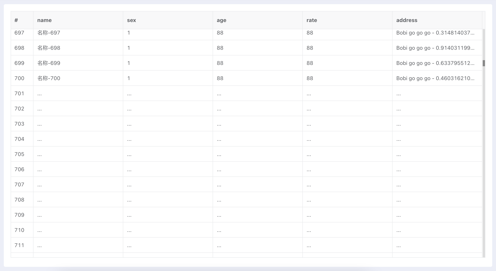

使用表格显示行很多的数据时，Element Ui 和 iView 的表格组件的效率都非常低，几百行就很卡了，这种场景可以使用虚拟表格组件来进行优化，下面我们使用 [Vxe-table](https://xuliangzhan_admin.gitee.io/vxe-table/#/table/start/install) 来实现。

各种前端虚拟表格的例子中，基本都是把大量数据一次性加载到浏览器内存里，或者不停的追加到数据后面，然后使用虚拟表格进行显示，Vxe-table 也不例外。而我们下面想实现的需求是例如一个 SQL 语句查询会得到 20000 万数据，但是不想把所有数据一次性查出来给前端表格，而是让表格显示 20000 行占位数据，拖动滚动条的时候再使用分页加载的方式加载当前需要显示的数据。

**设计思路:**

1. 初始化时获取数据总行数 totalCount 和第一页的数据
2. 得到初始化数据后配置表格和显示第一页数据
   * 表格中创建 totalCount 行
   * 每一行都显示为占位行 (数据为 *...*)
3. 拖动滚动条时动态计算要显示的行的范围
   * Vxe-table 的 API 中没找到滚动时需要显示的行的范围，只好自己计算
   * 快速滚动时，例如从第 1 页快速滚动到第 10 页，中间快速滚动过的几页的数据不会加载，只会加载滚动条停下来时需要显示的数据，这是通过防抖技术实现的，这里使用了 [underscore](https://www.underscorejs.com.cn) 的 `_.debounce(this.doLoadData, 200)`
4. 如果要显示的行的数据没有加载过则从服务器加载，如果加载过了则不重复加载
   * 计算出行所在的页码，使用分页查询，加载对应页的数据
   * 把对应的占位行的数据替换为加载到的数据
   * 加载过的页码会缓存起来，加载前都会判断一下是否已经加载过，避免重复加载

下图展示了滚动停下来时，当前要显示的行跨 2 页，前一页的数据已经加载完成了，后一页显示为占位行，因为它的数据本地还没有，则会发送请求加载这一页的数据，得到数据后会把对应的占位行替换为真实的数据。

> 提示: 要显示的行有可能都在同一页，也有可能跨 2 页 (每页加载的数量不要小于表格可视行的数量)。



**业务代码只需要在下面代码的基础上进行简单修改:**

* 修改配置 (使用现在的默认值也没问题):
  * tableHeight (可在页面初始化时动态计算)
  * rowHeight
  * pageSize

* 请求数据函数 (修改为从服务器端加载数据的代码):
  * requestTotalCount
  * requestPageData

## 环境准备

需要安装依赖库:

* 点击 [Vxe-table](https://xuliangzhan_admin.gitee.io/vxe-table/v3/#/table/start/install) 了解 Vxe-table 的安装

* 把 [underscore](https://www.underscorejs.com.cn) 的 js 文件加载到项目中，例如

  ```html
  <script src="//underscorejs.org/underscore-min.js"></script>
  ```

## 模拟数据、动态加载

此案例不需要服务器端支持，请求数据函数 `requestTotalCount 和 requestPageData` 都是本地 JS 模拟产生数据。

```html
<template>
    <div class="about">
        <vxe-table v-if="initialized"
            border
            show-overflow
            ref="vTable"
            :height="tableHeight"
            :row-config="{ isHover: true, height: this.rowHeight }"
            :sort-config="{ trigger: 'cell' }"
            @scroll="handleScroll"
        >
            <vxe-column type="seq" width="60"></vxe-column>
            <!-- <vxe-column field="name" title="Name" sortable></vxe-column>
            <vxe-column field="sex" title="Sex"></vxe-column>
            <vxe-column field="age" title="Age"></vxe-column>
            <vxe-column field="address" title="Address" show-overflow></vxe-column> -->
            <template v-for="col in columns">
                <vxe-column :field="col.field" :title="col.title" :key="col.field"></vxe-column>
            </template>
        </vxe-table>
    </div>
</template>

<script>
import Vue from 'vue';
import 'xe-utils';
import VXETable from 'vxe-table';
import 'vxe-table/lib/style.css';

Vue.use(VXETable);

/*
提示:
1. 页码 pageNumber 从 1 开始
2. 数量 pageSize 最小值为 1
3. 下标 offset 从 0 开始
*/

/**
 * 计算指定页在数组中的下标，从 0 开始
 *
 * @param {Int} pageNumber 页码
 * @param {Int} pageSize   数量
 * @returns 返回起始下标
 */
function calculatePageOffset(pageNumber, pageSize) {
    pageNumber = Math.max(1, pageNumber);
    pageSize = Math.max(1, pageSize);

    const offset = (pageNumber - 1) * pageSize;
    return offset;
}

/**
 * 计算下标 offset 所在的页码
 *
 * @param {Int} offset 行的下标
 * @param {Int} pageSize 数量
 * @returns 返回页码
 */
function calculatePageNumber(offset, pageSize) {
    offset = Math.max(0, offset);
    pageSize = Math.max(1, pageSize);

    const pageNumber = Math.floor(offset / pageSize) + 1;
    return pageNumber;
}

export default {
    data() {
        return {
            tableData        : [],  // 表格的数据
            tableHeight      : 650, // 表格的高度
            rowHeight        : 40,  // 表格的行高
            pageSize         : 50,  // 从服务器加载的每页数据量，不要小于表格的可视行数
            totalCount       : 0,   // 表格数据的总行数
            initialized      : false, // 是否初始化完成
            previousScrollTop: 0,     // 前一次表格滚动的位置
            loadData         : null,  // 从服务器加载数据的函数
            loadedPages      : new Set(), // 已经加载过数据的页码，避免重复加载

            // 表格的列 (如果是固定列，则可以在此配置)
            columns: [
                // { field: 'name', title: 'Name' },
                // { field: 'sex', title: 'Sex' },
                // { field: 'age', title: 'Age' },
                // { field: 'address', title: 'Address' },
            ]
        };
    },
    mounted() {
        // 使用防抖方式从服务器端加载数据，避免频繁发送请求
        this.loadData = _.debounce(this.doLoadData, 200);

        this.init();
    },
    methods: {
        // 请求数据并初始化表格
        init() {
            /*
            初始化逻辑:
            1. 标记第 1 已经被加载
            2. 请求总行数和第一页的数据
            3. 使用查询得到的第一个对象的属性创建表格的列 (如果列是固定的场景，就不需要这一步了)
            4. 使用查询得到的第一个对象的属性创建一个占位对象，所有属性的值都为 '...'
            5. 使用占位对象填充 tableData，共 totalCount 个
            6. 标记初始化完成，创建表格
            7. 把请求得到的第一页数据更新到表格中
            */

            // [1] 标记第 1 已经被加载
            this.loadedPages.add(1);

            // [2] 请求总行数和第一页的数据
            Promise.all([this.requestTotalCount(), this.requestPageData(1)]).then(([count, pageData]) => {
                this.totalCount = count;
                const data = pageData.data;

                // [3] 使用查询得到的第一个对象的属性创建表格的列 (如果列是固定的场景，就不需要这一步了)
                for (let key of Object.keys(data[0])) {
                    this.columns.push({ field: key, title: key });
                }

                // [4] 使用查询得到的第一个对象的属性创建一个占位对象，所有属性的值都为 '...'
                const placeholder = {};
                for (let key of Object.keys(data[0])) {
                    placeholder[key] = '...';
                }

                // [5] 使用占位对象填充 tableData，共 totalCount 个
                for (let i = 0; i < this.totalCount; i++) {
                    this.tableData.push(Object.assign({}, placeholder));
                }

                // [6] 标记初始化完成，创建表格
                this.initialized = true;

                // [7] 把请求得到的第一页数据更新到表格中
                this.updatePageDataIntoTable({ data: pageData.data, pageNumber: 1 });
            });
        },
        // 请求总行数，返回 Promise 对象，成功的参数为总行数
        requestTotalCount() {
            return new Promise(resolve => {
                setTimeout(() => {
                    resolve(5000);
                }, 200);
            });
        },
        // 请求指定页的数据，返回 Promise 对象，成功的参数为 { data, pageNumber }
        requestPageData(pageNumber) {
            // 模拟从服务器获取数据
            return new Promise(resolve => {
                const data = [];
                let firstRowIndex = calculatePageOffset(pageNumber, this.pageSize);

                for (let i = 0; i < this.pageSize; i++) {
                    const index = firstRowIndex + i;
                    const row = {
                        name: `名称-${index+1}`,
                        sex: '1',
                        age: 88,
                        rate: 88,
                        address: 'Bobi go go go - ' + Math.random()
                    };

                    data.push(row);
                }

                setTimeout(() => {
                    resolve({ data, pageNumber });
                }, 200);
            });
        },
        // 处理滚动事件，加载要显示的数据
        handleScroll({ scrollTop, isY }) {
            if (isY) {
                // Fix: $table.reloadData(this.tableData) 加载数据后会产生很多 scroll 事件，但是 scrollTop 都是一样的，
                // 为了避免处理重复产生的 scroll 事件，提前返回。
                if (this.previousScrollTop === scrollTop) {
                    return;
                }

                this.previousScrollTop = scrollTop;

                // vxe-table 没有当前可视范围内的行号，需要自己计算
                let firstRow = Math.floor(scrollTop / this.rowHeight);
                let lastRow  = Math.floor((scrollTop + this.tableHeight) / this.rowHeight);

                // 不能超过最大行
                lastRow = lastRow > this.totalCount ? this.totalCount : lastRow;

                // 使用防抖方式从服务器端加载数据，避免频繁发送请求
                this.loadData(firstRow, lastRow);
            }
        },
        // 加载数据: firstRow 为要显示的第一行，lastRow 为要显示的最后一行
        doLoadData(firstRow, lastRow) {
            /*
            加载数据逻辑:
            1. 根据要显示的行计算出所在的页码 (当前可视区域的行有可能跨 2 页显示, pageSize 不要小于可视行数，避免可视区跨超过 2 页显示)
            2. 检查对应页的数据是否加载
            3. 如果是同一页的数据，设置 page2Loaded 为 true 避免重复加载
            4. 如果页的数据没有加载过，则进行加载
            5. 页的数据加载完成后显示到表格中
            */

            // [1] 根据要显示的行计算出所在的页码 (当前可视区域的行有可能跨 2 页显示, pageSize 不要小于可视行数，避免可视区跨超过 2 页显示)
            const page1 = calculatePageNumber(firstRow, this.pageSize);
            const page2 = calculatePageNumber(lastRow, this.pageSize);

            // 打印日志
            const page1FirstRow = calculatePageOffset(page1, this.pageSize);
            const page2FirstRow = calculatePageOffset(page2, this.pageSize);

            console.log(`首行-${firstRow+1}, 末行-${lastRow+1}, 首页-${page1}, 末页-${page2}, 首页的首行 - ${page1FirstRow+1}, 末页的首行 - ${page2FirstRow+1}`);

            // [2] 检查对应页的数据是否加载
            let page1Loaded = this.loadedPages.has(page1);
            let page2Loaded = this.loadedPages.has(page2);

            // [3] 如果是同一页的数据，设置 page2Loaded 为 true 避免重复加载
            if (page1 === page2) {
                page2Loaded = true;
            }

            // [4] 如果页的数据没有加载过，则进行加载
            if (!page1Loaded) {
                this.loadedPages.add(page1);
                this.requestPageData(page1).then((pageData) => {
                    // [5] 页的数据加载完成后显示到表格中
                    this.updatePageDataIntoTable(pageData);
                });
            }

            if (!page2Loaded) {
                this.loadedPages.add(page2);
                this.requestPageData(page2).then((pageData) => {
                    this.updatePageDataIntoTable(pageData);
                });
            }
        },
        // 更新指定页的数据到表格中
        updatePageDataIntoTable(pageData) {
            this.$nextTick(() => {
                /*
                更新逻辑:
                1. 计算页的第一行下标
                2. 把占位数据替换为页的数据
                3. 更新数据到虚拟表格
                */
                const data = pageData.data;

                // [1] 计算页的第一行下标
                const firstRowIndex = calculatePageOffset(pageData.pageNumber, this.pageSize);

                // [2] 把占位数据替换为页的数据
                for (let i = 0; i < data.length; i++) {
                    const index = firstRowIndex + i;
                    this.tableData.splice(index, 1, data[i]);
                }

                // [3] 更新数据到虚拟表格
                const $table = this.$refs.vTable;
                $table.reloadData(this.tableData);

                console.log(`加载第 ${pageData.pageNumber} 页的数据`);
            });
        },
    }
};
</script>

<style lang="scss">
</style>
```

## 业务数据、动态加载

此案例需要服务器端支持，展示在业务中使用的代码，以上面的例子相比，只是修改了请求数据函数 `requestTotalCount 和 requestPageData` 都从服务器端加载数据，其他地方都没有动。

> 实际使用时，需要根据业务数据调整列宽: `<vxe-column field="sex" title="Sex" width="150"></vxe-column>`

```html
<template>
    <div class="about">
        <vxe-table v-if="initialized"
            border
            show-overflow
            ref="vTable"
            :height="tableHeight"
            :row-config="{ isHover: true, height: this.rowHeight }"
            :sort-config="{ trigger: 'cell' }"
            @scroll="handleScroll"
        >
            <vxe-column type="seq" width="60"></vxe-column>
            <!-- <vxe-column field="name" title="Name" sortable></vxe-column>
            <vxe-column field="sex" title="Sex"></vxe-column>
            <vxe-column field="age" title="Age"></vxe-column>
            <vxe-column field="address" title="Address" show-overflow></vxe-column> -->
            <template v-for="col in columns">
                <vxe-column :field="col.field" :title="col.title" :key="col.field"></vxe-column>
            </template>
        </vxe-table>
    </div>
</template>

<script>
import Vue from 'vue';
import 'xe-utils';
import VXETable from 'vxe-table';
import 'vxe-table/lib/style.css';

Vue.use(VXETable);

/*
业务代码需要修改的地方:
1. 修改配置中的:
    tableHeight
    rowHeight
    pageSize
2. 请求数据函数:
    requestTotalCount
    requestPageData

提示:
1. 页码 pageNumber 从 1 开始
2. 数量 pageSize 最小值为 1
3. 下标 offset 从 0 开始
*/

/**
 * 计算指定页在数组中的下标，从 0 开始
 *
 * @param {Int} pageNumber 页码
 * @param {Int} pageSize   数量
 * @returns 返回起始下标
 */
function calculatePageOffset(pageNumber, pageSize) {
    pageNumber = Math.max(1, pageNumber);
    pageSize = Math.max(1, pageSize);

    const offset = (pageNumber - 1) * pageSize;
    return offset;
}

/**
 * 计算下标 offset 所在的页码
 *
 * @param {Int} offset 行的下标
 * @param {Int} pageSize 数量
 * @returns 返回页码
 */
function calculatePageNumber(offset, pageSize) {
    offset = Math.max(0, offset);
    pageSize = Math.max(1, pageSize);

    const pageNumber = Math.floor(offset / pageSize) + 1;
    return pageNumber;
}

export default {
    data() {
        return {
            tableData        : [],  // 表格的数据
            tableHeight      : 650, // 表格的高度
            rowHeight        : 40,  // 表格的行高
            pageSize         : 50,  // 从服务器加载的每页数据量，不要小于表格的可视行数
            totalCount       : 0,   // 表格数据的总行数
            initialized      : false, // 是否初始化完成
            previousScrollTop: 0,     // 前一次表格滚动的位置
            loadData         : null,  // 从服务器加载数据的函数
            loadedPages      : new Set(), // 已经加载过数据的页码，避免重复加载

            // 表格的列 (如果是固定列，则可以在此配置)
            columns: [
                // { field: 'name', title: 'Name' },
                // { field: 'sex', title: 'Sex' },
                // { field: 'age', title: 'Age' },
                // { field: 'address', title: 'Address' },
            ]
        };
    },
    mounted() {
        // 使用防抖方式从服务器端加载数据，避免频繁发送请求
        this.loadData = _.debounce(this.doLoadData, 200);

        this.init();
    },
    methods: {
        // 请求数据并初始化表格
        init() {
            /*
            初始化逻辑:
            1. 标记第 1 已经被加载
            2. 请求总行数和第一页的数据
            3. 使用查询得到的第一个对象的属性创建表格的列 (如果列是固定的场景，就不需要这一步了)
            4. 使用查询得到的第一个对象的属性创建一个占位对象，所有属性的值都为 '...'
            5. 使用占位对象填充 tableData，共 totalCount 个
            6. 标记初始化完成，创建表格
            7. 把请求得到的第一页数据更新到表格中
            */

            // [1] 标记第 1 已经被加载
            this.loadedPages.add(1);

            // [2] 请求总行数和第一页的数据
            Promise.all([this.requestTotalCount(), this.requestPageData(1)]).then(([count, pageData]) => {
                this.totalCount = count;
                const data = pageData.data;

                // [3] 使用查询得到的第一个对象的属性创建表格的列 (如果列是固定的场景，就不需要这一步了)
                for (let key of Object.keys(data[0])) {
                    this.columns.push({ field: key, title: key });
                }

                // [4] 使用查询得到的第一个对象的属性创建一个占位对象，所有属性的值都为 '...'
                const placeholder = {};
                for (let key of Object.keys(data[0])) {
                    placeholder[key] = '...';
                }

                // [5] 使用占位对象填充 tableData，共 totalCount 个
                for (let i = 0; i < this.totalCount; i++) {
                    this.tableData.push(Object.assign({}, placeholder));
                }

                // [6] 标记初始化完成，创建表格
                this.initialized = true;

                // [7] 把请求得到的第一页数据更新到表格中
                this.updatePageDataIntoTable({ data: pageData.data, pageNumber: 1 });
            });
        },
        // 请求总行数，返回 Promise 对象，成功的参数为总行数
        requestTotalCount() {
            return Rest.url('/api/stocks/requests/count').data({ type: 'OUT', state: -1 }).get().then(response => {
                const totalCount = response.data;
                return totalCount;
            });
        },
        // 请求指定页的数据，返回 Promise 对象，成功的参数为 { data, pageNumber }
        requestPageData(pageNumber) {
            return Rest.url('/api/stocks/requests').data({ type: 'OUT', state: -1, pageNumber, pageSize: this.pageSize  }).get().then(response => {
                return { data: response.data, pageNumber };
            });
        },
        // 处理滚动事件，加载要显示的数据
        handleScroll({ scrollTop, isY }) {
            if (isY) {
                // Fix: $table.reloadData(this.tableData) 加载数据后会产生很多 scroll 事件，但是 scrollTop 都是一样的，
                // 为了避免处理重复产生的 scroll 事件，提前返回。
                if (this.previousScrollTop === scrollTop) {
                    return;
                }

                this.previousScrollTop = scrollTop;

                // vxe-table 没有当前可视范围内的行号，需要自己计算
                let firstRow = Math.floor(scrollTop / this.rowHeight);
                let lastRow  = Math.floor((scrollTop + this.tableHeight) / this.rowHeight);

                // 不能超过最大行
                lastRow = lastRow > this.totalCount ? this.totalCount : lastRow;

                // 使用防抖方式从服务器端加载数据，避免频繁发送请求
                this.loadData(firstRow, lastRow);
            }
        },
        // 加载数据: firstRow 为要显示的第一行，lastRow 为要显示的最后一行
        doLoadData(firstRow, lastRow) {
            /*
            加载数据逻辑:
            1. 根据要显示的行计算出所在的页码 (当前可视区域的行有可能跨 2 页显示, pageSize 不要小于可视行数，避免可视区跨超过 2 页显示)
            2. 检查对应页的数据是否加载
            3. 如果是同一页的数据，设置 page2Loaded 为 true 避免重复加载
            4. 如果页的数据没有加载过，则进行加载
            5. 页的数据加载完成后显示到表格中
            */

            // [1] 根据要显示的行计算出所在的页码 (当前可视区域的行有可能跨 2 页显示, pageSize 不要小于可视行数，避免可视区跨超过 2 页显示)
            const page1 = calculatePageNumber(firstRow, this.pageSize);
            const page2 = calculatePageNumber(lastRow, this.pageSize);

            // 打印日志
            const page1FirstRow = calculatePageOffset(page1, this.pageSize);
            const page2FirstRow = calculatePageOffset(page2, this.pageSize);

            console.log(`首行-${firstRow+1}, 末行-${lastRow+1}, 首页-${page1}, 末页-${page2}, 首页的首行 - ${page1FirstRow+1}, 末页的首行 - ${page2FirstRow+1}`);

            // [2] 检查对应页的数据是否加载
            let page1Loaded = this.loadedPages.has(page1);
            let page2Loaded = this.loadedPages.has(page2);

            // [3] 如果是同一页的数据，设置 page2Loaded 为 true 避免重复加载
            if (page1 === page2) {
                page2Loaded = true;
            }

            // [4] 如果页的数据没有加载过，则进行加载
            if (!page1Loaded) {
                this.loadedPages.add(page1);
                this.requestPageData(page1).then((pageData) => {
                    // [5] 页的数据加载完成后显示到表格中
                    this.updatePageDataIntoTable(pageData);
                });
            }

            if (!page2Loaded) {
                this.loadedPages.add(page2);
                this.requestPageData(page2).then((pageData) => {
                    this.updatePageDataIntoTable(pageData);
                });
            }
        },
        // 更新指定页的数据到表格中
        updatePageDataIntoTable(pageData) {
            this.$nextTick(() => {
                /*
                更新逻辑:
                1. 计算页的第一行下标
                2. 把占位数据替换为页的数据
                3. 更新数据到虚拟表格
                */
                const data = pageData.data;

                // [1] 计算页的第一行下标
                const firstRowIndex = calculatePageOffset(pageData.pageNumber, this.pageSize);

                // [2] 把占位数据替换为页的数据
                for (let i = 0; i < data.length; i++) {
                    const index = firstRowIndex + i;
                    this.tableData.splice(index, 1, data[i]);
                }

                // [3] 更新数据到虚拟表格
                const $table = this.$refs.vTable;
                $table.reloadData(this.tableData);

                console.log(`加载第 ${pageData.pageNumber} 页的数据`);
            });
        },
    }
};
</script>

<style lang="scss">
</style>
```

