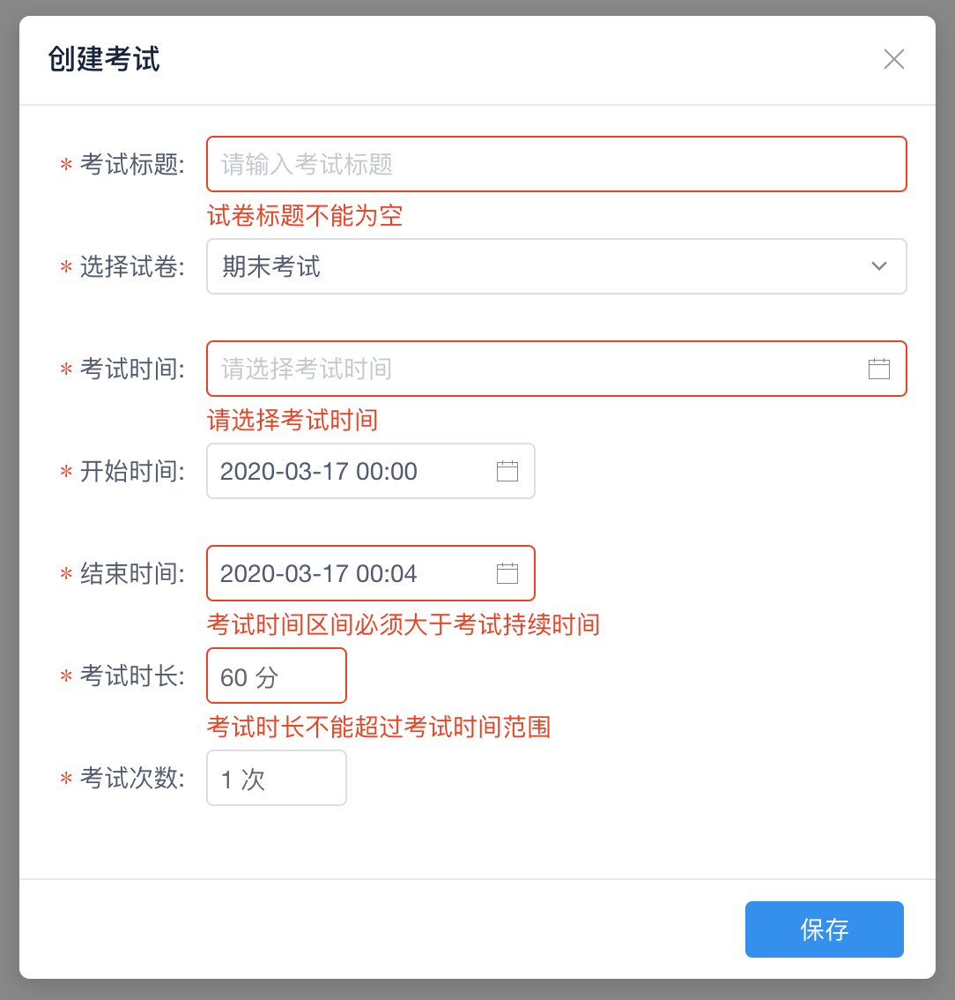

iView 的 Form 组件提供了基于 [async-validator](https://github.com/yiminghe/async-validator) 的[表单验证](https://www.iviewui.com/components/form-en#Form_Validation)功能，下面的例子相对更加典型，验证的规则涉及到:

* 空白字符串验证: `whitespace: true`
* 正则验证: `pattern: /^\d+$/`
* 日期验证: `type: 'date'` 以及自定义 validator
* 时间范围验证: 自定义 validator
* 复杂验证: validator 使用 Lambda，可以访问 Vue.prototype 中的数据
* 数字验证: `type: 'number'`
* 规则中有 `required: true` 则显示红色 `※`，否则不显示



触发验证有 3 种情况:

* 失去焦点: `trigger: 'blur'`
* 数据变化: `trigger: 'change'`
* 手动触发: `this.$refs.examForm.validate(valid => {})`

下面为示意图的实现代码:

```html
<template>
    <div class="exams">
        <Button type="primary" @click="popupModal">创建考试</Button>
        <div class="exam-list">

        </div>

        <!-- 考试编辑弹窗 -->
        <Modal v-model="modal" title="创建考试" :mask-closable="false" class="create-exam-modal">
            <Form ref="examForm" :model="examClone" :rules="examRules" :label-width="90">
                <FormItem label="考试标题:" prop="title">
                    <Input v-model="examClone.title" placeholder="请输入考试标题"/>
                </FormItem>

                <FormItem label="选择试卷:" prop="paperId">
                    <Select v-model="examClone.paperId">
                        <Option v-for="paper in papers" :value="paper.id" :key="paper.id">{{ paper.name }}</Option>
                    </Select>
                </FormItem>

                <FormItem label="考试时间:" prop="timeRange">
                    <DatePicker v-model="examClone.timeRange"
                                :editable="false"
                                type="datetimerange"
                                format="yyyy-MM-dd HH:mm"
                                separator=" 到 "
                                placement="bottom-end"
                                placeholder="请选择考试时间"
                                style="width: 100%">
                    </DatePicker>
                </FormItem>
                <FormItem label="开始时间:" prop="startTime">
                    <DatePicker v-model="examClone.startTime" type="datetime" :editable="false" format="yyyy-MM-dd HH:mm" placeholder="请选择开始时间"/>
                </FormItem>
                <FormItem label="结束时间:" prop="endTime">
                    <DatePicker v-model="examClone.endTime" type="datetime" :editable="false" format="yyyy-MM-dd HH:mm" placeholder="请选择结束时间"/>
                </FormItem>

                <FormItem label="考试时长:" prop="duration">
                    <InputNumber v-model="examClone.duration" :min="10" :formatter="value => `${value} 分`" :parser="value => value.replace(' 分', '')"/>
                </FormItem>

                <FormItem label="考试次数:" prop="maxTimes">
                    <InputNumber v-model="examClone.maxTimes" :min="1" :formatter="value => `${value} 次`" :parser="value => value.replace(' 次', '')"/>
                </FormItem>
            </Form>

            <div slot="footer">
                <Button type="primary" @click="createExam">保存</Button>
            </div>
        </Modal>
    </div>
</template>

<script>
export default {
    data() {
        return {
            exams: [],
            examClone: {},
            modal: false,
            papers: [
                { id: 'a', name: '无效考试' },
                { id: '1', name: '期末考试' },
            ],
            examRules: this.createExamRules(), // 表单验证规则 (使用函数创建，避免 data() 太长)
        };
    },
    methods: {
        // 弹出创建考试对话框
        popupModal() {
            this.$refs.examForm.resetFields();
            this.modal   = true;

            this.examClone = {
                title    : '', // 考试标题
                paperId  : '', // 试卷 ID
                startTime: '', // 开始时间
                endTime  : '', // 结束时间
                duration : 60, // 考试时长
                maxTimes : 1,  // 允许考试次数
                timeRange: [], // 时间选择器使用
            };
        },
        // 创建考试
        createExam() {
            this.$refs.examForm.validate(valid => {
                if (!valid) { return; }

                // 从时间选择器中获取开始和结束时间，表单提交使用
                this.examClone.startTime = this.examClone.timeRange[0];
                this.examClone.endTime   = this.examClone.timeRange[1];

                // 提交表单
                const exam = JSON.parse(JSON.stringify(this.examClone)); // 解决 Date 问题
                console.log(exam);
            });
        },
        // 创建验证规则
        createExamRules() {
            return {
                // 字符串验证
                title: [
                    { required: true, whitespace: true, message: '试卷标题不能为空', trigger: 'blur' }
                ],
                // 正则验证 (下拉框)
                paperId: [
                    { required: true, pattern: /^\d+$/, message: '请选择试卷', trigger: 'change' }
                ],
                // 时间范围验证
                timeRange: [
                    { required: true, message: '请选择考试时间', trigger: 'blur', validator: (rule, value, callback) => {
                        if (value.length !== 2) {
                            // 时间范围有 2 个元素，开始时间和结束时间
                            callback(new Error());
                        } else if (value.some(e => !e)) {
                            // 时间值不能为空
                            callback(new Error());
                        } else {
                            callback();
                        }
                    } }
                ],
                // 时间验证
                startTime: [
                    { required: true, type: 'date', message: '请选择开始时间', trigger: 'blur' }
                ],
                // 结束时间 (需要和开始时间进行逻辑判断: 没有提供 message，则使用创建 Error 的消息，否则只会使用提供的 message)
                endTime: [
                    { required: true, trigger: 'blur', validator: (rule, value, callback) => {
                        // 结束时间的校验:
                        // 1. 必须选择结束时间
                        // 2. 必须选择开始时间
                        // 3. 结束时间不能早于开始时间
                        // 4. 考试时间区间必须大于考试持续时间
                        // 5. 满足上面条件才验证通过

                        // [1] 必须选择结束时间
                        if (!value) {
                            callback(new Error('请选择结束时间'));
                            return;
                        }

                        // [2] 必须选择开始时间
                        if (!this.examClone.startTime) {
                            callback(new Error('请选择开始时间'));
                            return;
                        }

                        // 开始时间和结束时间的时间差 (毫秒)
                        const delta = this.examClone.endTime.getTime() - this.examClone.startTime.getTime();

                        // [3] 结束时间不能早于开始时间
                        if (delta <= 0) {
                            callback(new Error('结束时间不能早于开始时间'));
                            return;
                        }

                        // [4] 考试时间区间必须大于考试持续时间
                        if (delta / 60000 < this.examClone.duration) {
                            callback(new Error('考试时间区间必须大于考试持续时间'));
                            return;
                        }

                        // [5] 满足上面条件才验证通过
                        callback();
                    } }
                ],
                // 逻辑验证，validator 使用 Lambda，可以访问 Vue.prototype 中的数据
                duration: [
                    { required: true, message: '考试时长不能超过考试时间范围', trigger: 'change', validator: (rule, value, callback) => {
                        const startTime = this.examClone.timeRange[0];
                        const endTime   = this.examClone.timeRange[1];

                        if (!startTime || !endTime) {
                            callback(new Error());
                            return;
                        }

                        // 把时间段的毫秒转为分
                        const minutes = (endTime.getTime() - startTime.getTime()) / 1000 / 60;
                        if (value > minutes) { // value 即为 duration
                            callback(new Error());
                            return;
                        }

                        callback();
                    } }
                ],
                // 数字验证
                maxTimes: [
                    { required: true, type: 'number', min: 1, message: '请输入最大次数', trigger: 'change' }
                ]
            };
        },
    }
};
</script>

<style lang="scss">

</style>
```


## Date 问题

日期 (时间) 选择器 DatePicker 绑定的数据是 Date 对象，Date 对象传给后端时由于要序列化，默认使用的是 UTC Zero 时区，与北京时间相差 8 个小时，并且格式为 `2019-11-19T05:48:45.241Z`，与服务器端常用的格式 `2019-11-19 05:48:45` 不一致，所以时间对象在传给服务器前，需要我们自己先处理一下。

这个问题的根源是 `Date.prototype.toJSON()` 的默认实现导致的，我们可以重写这个方法校正时区和格式，在传给服务器前 `JSON.parse(JOSN.stringify(data))` 处理一下就可以解决 Date 的问题。

```js
Date.prototype.toJSON = function() {
    return dayjs(this).format('YYYY-MM-DD HH:mm:ss'); // 使用 dayjs，输出 2019-09-30 11:10:53，传给后端比较友好
    // return this.toLocaleString();                  // 输出: 9/30/2019, 11:10:53 AM，估计直接给后端会有小麻烦
}
```


