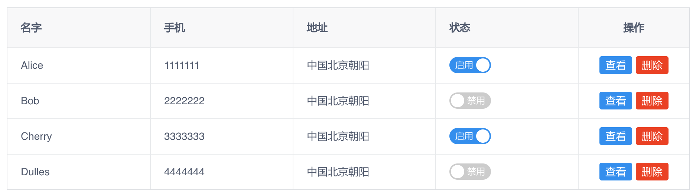
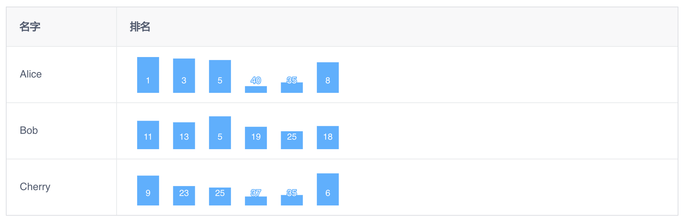

表格组件的使用文档请参考 [Table](https://www.iviewui.com/components/table-en)，我们主要是介绍 Table 使用过程中有必要记录的经验:

* 使用 Slot 显示 Button
* 使用 Slot 显示 Switch
* 使用 JSX 显示 Echarts
* 弹出对话框进行编辑

## 使用 Slot 显示 Button 和 Switch



> 提示: 
>
> * Columns 的每一列喜欢压缩为一行紧凑显示
> * Switch 的 v-model 需要和原对象的属性数据进行绑定，不要和 row 的属性绑定，因为 row 是对应行数据的副本，row.enabled 改变后，对应的 this.users[index].enabled 并没有改变。
> * 更新 enabled 失败后恢复 enabled

```js
<template>
    <div class="about">
        <Table :data="users" :columns="columns" border>
            <!-- 使用 Switch 显示状态 -->
            <template slot-scope="{ index }" slot="status">
                <i-switch v-model="users[index].enabled" :loading="loading" size="large" @on-change="enableUser(index)">
                    <span slot="open">启用</span>
                    <span slot="close">禁用</span>
                </i-switch>
            </template>

            <!-- 显示按钮 -->
            <template slot-scope="{ row, index }" slot="action">
                <Button type="primary" size="small" style="margin-right: 5px" @click="show(index)">查看</Button>
                <Button type="error" size="small" @click="remove(index)">删除</Button>
            </template>
        </Table>
    </div>
</template>

<script>
import UserDao from '@/../public/static/js/dao/UserDao';

export default {
    data() {
        return {
            users: [],
            columns: [
                { title: '名字', key : 'username' },
                { title: '手机', key : 'mobile' },
                { title: '地址', key : 'address' },
                { title: '状态', slot: 'status' },
                { title: '操作', slot: 'action', width: 150, align: 'center' },
            ],
            loading: false,
        };
    },
    mounted() {
        this.users = [
            { id: 1, username: 'Alice',  enabled: true, mobile: '1111111', address: '中国北京朝阳' },
            { id: 2, username: 'Bob',    enabled: true, mobile: '2222222', address: '中国北京朝阳' },
            { id: 3, username: 'Cherry', enabled: true, mobile: '3333333', address: '中国北京朝阳' },
            { id: 4, username: 'Dulles', enabled: true, mobile: '4444444', address: '中国北京朝阳' },
        ];
    },
    methods: {
        show(index) {

        },
        remove(index) {

        },
        // 启用禁用用户
        enableUser(index) {
            this.loading = true;
            const user = this.users[index]; // enabled 已经被 Switch 修改

            UserDao.enableUser(user.id, user.enabled).then(() => {
                this.$Message.info('更新成功');
                this.loading = false;
            }).catch(error => {
                user.enabled = !user.enabled; // 更新 enabled 失败后恢复 enabled
                this.$Message.error(error);
                this.loading = false;
            });
        }
    },
};
</script>

<style lang="scss">
.about {
    padding: 20px;
}
</style>
```

UserDao.js 模拟访问服务器方便查看效果:

```js
export default class UserDao {
    static enableUser(userId, enabled) {
        return new Promise((resolve, reject) => {
            setTimeout(() => {
                if (Date.now() % 2 !== 0) {
                    resolve();
                } else {
                    reject('更新失败');
                }
            }, 200);
        });
    }
}
```

## 使用 JSX 显示 Echarts



> 提示:
>
> * 需要使用 JSX 的方式显示图表，使用 Slot 好像实现不了
> * Echarts 图表需要显示到已经存在的 Dom Element 上，并且设置好宽高，所以在 render 返回后下一个事件循环中才创建图表
> * 对于排名的 bar: bar 的高度和名次的数值成反比，排名越高，数值越小，但 bar 越高，所以使用 `50-rank` 为 bar 的值，再通过自定义 Label 显示名次 (假设一个班有 40 人，用 50 是为了第 40 名的 bar 值为 10 ，显示出些效果好一些)
> * 为了能够重复利用配置，在 chartOption 中设置通用的配置，chart 中先使用它，然后 chart 再设置自己特有的 option，多次设置的 option 不会被覆盖，而是被合并
> * Echarts 的使用请参考 [Echarts 文档](https://www.echartsjs.com/examples/en/)

```js
<template>
    <div class="about">
        <Table :data="users" :columns="columns" border></Table>
    </div>
</template>

<script>
export default {
    props: {},
    data() {
        return {
            users: [],
            columns: [
                { title: '名字', key: 'username', width: 300 },
                { title: '排名', render: (h, { row: student }) => {
                    const ranks = student.ranks.map(r => 50 - r); // 排名数组，排名越低，值越大
                    const id    = 'rank-chart-' + Utils.nextId(); // 每个图表有唯一 ID

                    // 注意: 下一个事件循环中创建图表
                    this.$nextTick(() => {
                        const chartDom = document.getElementById(id);
                        if (!chartDom) { return; }

                        const chart = echarts.init(chartDom);         // 创建图表
                        chart.setOption(this.chartOption);            // 设置默认的设置
                        chart.setOption({ series: { data: ranks } }); // 设置数据
                    });

                    return (
                        <div id={ id } style="width: 300px; height: 60px;" class="ranks-chart"></div>
                    );
                } },
            ],
            chartOption: {},
        };
    },
    mounted() {
        this.users = [
            { username: 'Alice',  ranks: [1, 3, 5, 40, 35, 8] },
            { username: 'Bob',    ranks: [11, 13, 5, 19, 25, 18] },
            { username: 'Cherry', ranks: [9, 23, 25, 37, 35, 6] },
        ];

        this.chartOption = {
            color: ['#5cadff'],
            grid : { left: 0, right: 5, top: 5, bottom: 5 },
            xAxis: {
                type: 'category',
                show : false,
            },
            yAxis: {
                show: false,
                type: 'value',
                min : 1,
                max : 50,
            },
            series: {
                data: [],
                type: 'bar',
                barWidth: 30,
                label: {
                    normal: {
                        show         : true,
                        align        : 'center',
                        verticalAlign: 'bottom',
                        position     : 'insideBottom',
                        // formatter: '{c}', // 使用 Echarts 提供的变量进行格式化
                        formatter: (val) => {
                            return 50 - val.value; // 自定义 Label
                        },
                    }
                },
            }
        };
    },
    methods: {}
};
</script>

<style lang="scss">
.about {
    padding: 20px;
}
</style>
```

