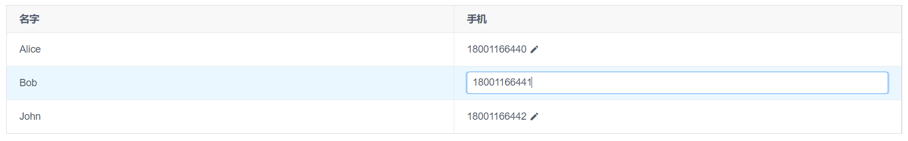

如上图，点击单元格在单元格中显示输入框进行编辑，按下回车保存编辑结果，输入框失去焦点或者按下 ESC 时取消编辑。

使用 iView 的 Table 组件时需要注意的一点是 `<template slot-scope="{ row: user }" slot="mobile">` 得到的行对象是传给 Table 的对象的副本，因为 iView 要在这些对象中保存表格相关的信息，而不能影响原始数据，原始数据变化后 Table 会得到通知更新表格，表格的行对象变化后原始数据不会进行同步。所以在处理编辑的保存和取消时需要我们自己进行数据的同步。

此外，为了更好的用户体验，输入框显示后要能够自动获得焦点。

```html
<template>
    <div class="about">
        <Table :data="users" :columns="columns" border>
              <template slot-scope="{ row: user }" slot="mobile">
                    <div v-show="selectedUser !== user">
                        {{ user.mobile }}
                        <Icon type="md-create" @click="selectedUser = user"/>
                    </div>
                    <Input v-if="selectedUser === user"
                        v-model="user.mobile"
                        v-focus="selectedUser === user"
                        @on-enter="saveMobile(user)"
                        @on-blur="cancelEditMobile(user)"
                        @on-keyup="cancelEditMobile(user, $event)"
                    />
              </template>
        </Table>
    </div>
</template>

<script>
export default {
    data() {
        return {
            users: [
                { id: 1, name: 'Alice', mobile: '18001166440' },
                { id: 2, name: 'Bob', mobile: '18001166441' },
                { id: 3, name: 'John', mobile: '18001166442' },
            ],
            columns: [
                { key: 'name', title: '名字' },
                { slot: 'mobile', title: '手机' },
            ],
            selectedUser: {}, // 表格中选中的对象，注意它不是 users 中的对象的引用
        };
    },
    mounted() {
    },
    methods: {
        // 保存手机号码
        saveMobile(user) {
            // 1. 保存修改到服务器
            // 2. 保存成功
            //    2.1 使用表格中的数据更新 users 中对应对象的数据
            //    2.2 重置选中的对象，隐藏输入框

            // [1] 保存修改到服务器
            // 使用 timeout 模拟 Http 提交
            setTimeout(() => {
                // [2.1] 使用表格中的数据更新 users 中对应对象的数据
                this.users.filter(u => u.id === user.id).forEach(u => {
                    u.mobile = user.mobile;
                });

                // [2.2] 重置选中的对象，隐藏输入框
                this.selectedUser = {};
            }, 100);
        },
        // 取消编辑手机号码
        cancelEditMobile(user, keyEvent) {
            // 1. 如果 keyEvent 存在且它的 key 为 Escape，说明是按下 ESC 键取消编辑
            // 2. 使用 users 中的数据恢复表格中对象的数据
            // 3. 重置选中的对象，隐藏输入框

            // [1] 如果 keyEvent 存在且它的 key 为 Escape，说明是按下 ESC 键取消编辑
            if (keyEvent && keyEvent.key !== 'Escape') {
                return;
            }

            // [2] 使用 users 中的数据恢复表格中对象的数据
            this.users.filter(u => u.id === user.id).forEach(u => {
                user.mobile = u.mobile;
            });

            // [3] 重置选中的对象，隐藏输入框
            this.selectedUser = {};
        }
    },
    directives: {
        // 输入框获取焦点命令 (binding.value 为 v-focus="xxx" 的参数 xxx)
        focus: function(el, binding) {
            if (binding.value) {
                setTimeout(() => {
                    el.querySelector('input').focus();
                }, 0);
            }
        }
    }
};
</script>

<style lang="scss">
</style>
```

