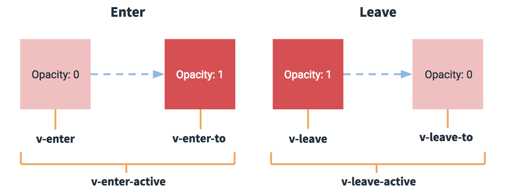
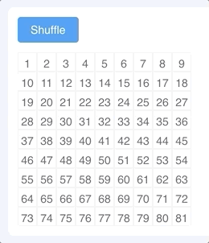

Vue 提供了[过渡动画](https://cn.vuejs.org/v2/guide/transitions.html)的支持，关键是在进入/离开的过渡中，会有 6 个 class 切换:

<style>
	table td:nth-child(1), table td:nth-child(2) {
		white-space: nowrap;
	}
</style>

| 动画名         | 作用                         | 说明                                                         |
| -------------- | ---------------------------- | ------------------------------------------------------------ |
| v-enter        | 定义`进入的过渡`的开始状态   | 在元素被`插入之前`生效，在元素被插入之后的下一帧移除         |
| v-enter-active | 定义`进入的过渡`的生效时状态 | 在整个进入过渡的阶段中应用，在元素被`插入之前`生效，在过渡/动画完成之后移除。这个类可以被用来定义进入过渡的过程时间、延迟和曲线函数 |
| v-enter-to     | 定义`进入的过渡`的结束状态   | 在元素被`插入之后下一帧`生效 (与此同时 `v-enter` 被移除)，在过渡/动画完成之后移除 |
| v-leave        | 定义`离开的过渡`的开始状态   | 在离开过渡被触发时立刻生效，下一帧被移除                     |
| v-leave-active | 定义`离开的过渡`的生效时状态 | 在整个离开过渡的阶段中应用，在离开过渡被触发时立刻生效，在过渡/动画完成之后移除。这个类可以被用来定义离开过渡的过程时间，延迟和曲线函数 |
| v-leave-to     | 定义`离开的过渡`的结束状态   | 在离开过渡被触发之后下一帧生效 (与此同时 `v-leave` 被删除)，在过渡/动画完成之后移除 |



过渡相关的 class 变化:

1. 创建元素，class 为 v-enter 和 v-enter-active，插入元素到 Document
2. 下一帧时删除 v-enter, 增加 v-enter-to，这时元素的属性发生了变化，则使用动画插值修改变化的属性
3. 动画结束时删除 v-enter-active 和 v-enter-to
4. 删除元素前增加 class v-leave 和 v-leave-active
5. 下一帧时删除 v-leave，增加 v-leave-to，这时元素的属性发生了变化，则使用动画插值修改变化的属性
6. 动画结束时删除 v-leave-active 和 v-leave-to，从 Document 删除元素

不过要掌握好也是不容易的，可以先搜索学习一下其他人的笔记先入门，例如[动画过渡 Transition 示例](https://www.toutiao.com/i6755503906421211659/)，然后再去看[官方文档](https://cn.vuejs.org/v2/guide/transitions.html)深入了解，这里我们就不进行理解知识介绍了，只罗列 2 个常见例子: 单元素的动画和列表元素的动画，偶尔用一下即可。

> 提示: 
>
> * 在 v-enter, v-enter-to, v-leave, v-leave-to 中只定义动画开始和结束时的状态 (长宽、边框、背景色等)
> * 在 v-enter-active, v-leave-active 中只定义过渡的持续时间、延迟和曲线函数，不要定义状态
> * 当 v-enter, v-leave 被删除时动画效果开始，因为属性变化了

## 单元素的动画

为了给单个元素增加动画，需要:

* 把要使用动画的元素包裹在 `<transition>` 中，name 为动画的名字
* 通过控制变量让使用动画的元素是否可见

```html
<Button @click="visible=!visible">Show</Button>

<transition name="fade">
    <div v-if="visible">你好</div>
</transition>
```

> Vue 内嵌了几个常用动画，例如 fade, slide-up, slide-down 等，可以直接使用。

## 列表项的动画

为了给列表项增加动画，需要:

* 把列表项 (v-for 的 item) 包裹在 `<transition-group>` 中，name 为动画的名字
* 定义 `<transition-group>` 的属性:
  * 使用 **tag** 指定列表项的父元素为 div，ul 等
  * 定义 **class** 为列表项的父元素的  class

实现下面动画效果:


```js
<template>
    <div class="about">
        <Button type="primary" @click="append">添加用户</Button>
        <Button @click="insert">插入用户</Button>
        <Button @click="pop">删除用户</Button>

        <!-- 列表项 (v-for) 的动画使用 transition-group，默认的动画有 fade, slide-up, slide-down 等 -->
        <transition-group name="list-animated" tag="div" class="users">
            <div v-for="(user, index) in users" :key="user" class="user">
                <Tag color="warning">{{ user }}</Tag>
                {{ user }}
                <Icon type="md-close" @click="remove(index)"/>
            </div>
        </transition-group>
    </div>
</template>

<script>
export default {
    data() {
        return {
            users: ['Alice', 'Bob', 'Cherry'],
            show: true
        };
    },
    methods: {
        append() {
            this.users.push(Date.now() + '');
        },
        insert() {
            this.users.splice(2, 0, Date.now() + '');
        },
        pop() {
            this.users.pop();
        },
        remove(index) {
            this.users.splice(index, 1);
        },
    }
};
</script>

<style lang="scss">
// 列表项的过渡效果
.about .users .user {
    transition: all .6s;

    &.list-animated-enter, &.list-animated-leave-to {
        opacity: 0;
        transform: translateY(30px);
    }

    &.list-animated-leave-active {
        position: absolute;
    }
}

// 普通样式
.about {
    button {
        margin-right: 12px;
    }

    .users {
        padding: 12px;
        margin-top: 12px;
        border: 1px solid #eee;
        border-radius: 4px;

        .user {
            padding: 10px;
            border-radius: 4px;
            background: #eee;

            &:not(:first-child) {
                margin-top: 12px;
            }
        }
    }
}
</style>
```

实现下面的动画效果:



```js
<template>
    <div class="about">
        <Button type="primary" @click="shuffle">Shuffle</Button>

        <transition-group name="flip-list" tag="div" class="items">
            <span v-for="item in items" v-bind:key="item" class="item">
            {{ item }}
            </span>
        </transition-group>
    </div>
</template>

<script>
export default {
    data() {
        return {
            items: [],
        };
    },
    mounted() {
        for (let i = 1; i < 82; i++) {
            this.items.push(i);
        }
    },
    methods: {
        shuffle: function () {
            this.items = _.shuffle(this.items); // 随机打乱数组，使用了 underscore，或者自己实现一下
        }
    }
};
</script>

<style lang="scss">
.flip-list-move {
    transition: transform 2.8s;
}

.items {
    display: flex;
    width: 220px;
    flex-wrap: wrap;
    margin-top: 12px;
}

.item {
    display: inline-block;
    border: 1px solid #eee;
    width: 24px;
    height: 24px;
    line-height: 26px;
    text-align: center;
}
</style>
```

