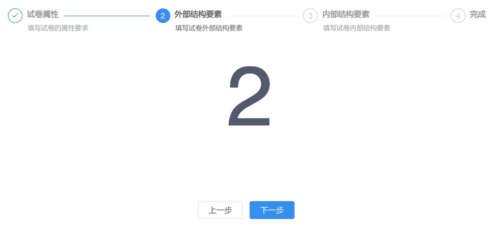

操作比较复杂时，全放在一页中的话会比较乱，如果按业务逻辑分成几个部分，编辑完前一步后才能继续下一步，操作逻辑更清晰，对用户比较友好，如图所示:



这种模式的操作，我们总结出下面的模板:

```js
<!-- 编辑试卷模型 -->
<template>
    <div class="paper-model-edit">
        <!-- 显示每一步的信息提示 -->
        <Steps :current="step-1">
            <Step title="试卷属性" content="填写试卷的属性要求"></Step>
            <Step title="外部结构要素" content="填写试卷外部结构要素"></Step>
            <Step title="内部结构要素" content="填写试卷内部结构要素"></Step>
            <Step title="完成" content=""></Step>
        </Steps>

        <!-- 每一步的具体数据展示和操作 -->
        <div v-show="step===1" class="content">1</div>
        <div v-show="step===2" class="content">2</div>
        <div v-show="step===3" class="content">3</div>
        <div v-show="step===4" class="content">4</div>

        <!-- 使用组件
            <Com v-show="step===3" ref="com" class="content"/> 
        -->

        <!-- 导航按钮 -->
        <center class="buttons">
            <Button v-show="buttons.prevButtonVisible" @click="prevStep">上一步</Button>
            <Button v-show="buttons.nextButtonVisible" type="primary" @click="nextStep">下一步</Button>
        </center>
    </div>
</template>

<script>
export default {
    data() {
        return {
            step: 1,   // 当前执行到的步骤
            buttons: { // 按钮状态
                prevButtonVisible: false,
                nextButtonVisible: true,
            }
        };
    },
    methods: {
        // 上一步
        prevStep() {
            if (this.step > 1) {
                this.step -= 1;
            }
        },
        // 下一步
        nextStep() {
            // 点击下一步按钮时，常规的逻辑为:
            // 1. 检查数据的有效性
            //    1.1 数据有效，保存到服务器
            //        1.1.1 保存成功，进入下一步
            //        1.1.2 保存失败，提示错误
            //    1.2 数据无效，提示错误

            if (this.step === 1) {
                new Promise((resolve, reject) => {
                    Date.now() % 2 === 0 ? resolve() : reject();
                }).then(() => {
                    // 成功进入下一步
                    this.step += 1;
                }).catch(() => {
                    // 错误不进入下一步，提示错误信息
                    this.$Message.error('错误');
                });
            } else if (this.step === 2) {
                // ... 参考上面的模式
                this.step += 1;
            } /* else if (this.step === 3) {
                // 组件中保存成功后继续下一步
                this.$refs.com.save().then(() => {
                    this.step += 1;
                });
            } */
        },
        // 更新按钮状态, 每一步时按钮有自己的状态
        updateButtons() {
            if (this.step === 1) {
                this.buttons.prevButtonVisible = false;
                this.buttons.nextButtonVisible = true;
            } else if (this.step === 2) {
                this.buttons.prevButtonVisible = true;
                this.buttons.nextButtonVisible = true;
            } else if (this.step === 3) {
                this.buttons.prevButtonVisible = true;
                this.buttons.nextButtonVisible = true;
            } else if (this.step === 4) {
                this.buttons.prevButtonVisible = true;
                this.buttons.nextButtonVisible = false;
            }
        },
    },
    watch: {
        // step 变化时更新按钮的状态
        step() {
            this.updateButtons();
        }
    }
};
</script>

<style lang="scss">
.paper-model-edit {
    .content {
        width : 200px;
        height: 300px;
        margin: 0 auto;
        font-size: 150px;
        text-align: center;
    }

    .buttons button {
        min-width: 80px;
        margin-right: 12px;
    }
}
</style>
```

