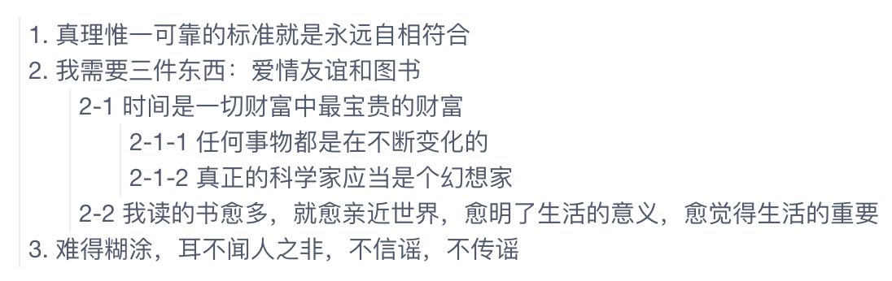

层级结构，也即树结构，是很常见的，例如部门的组织结构，书的章节目录，论坛里帖子的回复等等，可以使用递归的方式遍历树结构的数据，Vue 的组件也能够使用递归的方式展示层级结构的数据，例如实现下图中所示的回复结构:

<center></center>
使用 Vue 实现组件 `Reply` 来完成上图的效果。<!--more-->

## Reply.vue

树的递归遍历很简单:

* 访问节点的数据
* 递归遍历孩子节点

```js
function recursive(node) {
    console.log(node.name);

    // 如果存在孩子节点，则递归访问孩子节点
    node.children && node.children.forEach(child => {
        recursive(child);
    });
}
```

Vue 的递归组件结构也和上面的代码差不多，不过需要注意以下几点:

* 根节点的 id 为 0，或者通过其他属性来判断是否根节点
* 注意递归的结束判断，避免无穷递归
* 递归组件: 组件可以在它们自己的模板中调用自身，不过它们只能通过 `name` 选项来做这件事，例如下面给组件设置属性 `name: 'Reply'`，然后在模板中就可以使用 `Reply` 调用自己进行递归调用了
* SCSS 样式部分不是必须的，根据需求调整为自己需要的效果

```js
<template>
    <li :class="[data.id==0 ? 'root': '', 'reply']">
        <div class="name">{{ data.content }}</div>

        <ul v-if="data.children">
            <Reply v-for="child in data.children" :key="child.id" :data="child"/>
        </ul>
    </li>
</template>

<script>
export default {
    name: 'Reply', // 递归组件需要设置 name 属性，才能在模板中调用自己
    props: {
        // data 为 { id: 1, content: 'xxx', children: [] } 的嵌套结构
        data: { type: Object, required: true }
    },
};
</script>

<style lang="scss">
.reply {
    padding-left: 4px;
    border-left: 1px solid #eee;

    ul {
        padding-left: 20px;
        list-style: none;
    }
}

// Root 节点是虚拟节点，隐藏起来
.reply.root {
    list-style: none;
    border-left: none;

    > ul { padding-left: 0; }
    > .name { display: none; }
}
</style>
```

## Demo.vue

使用上面的组件 `Reply`:

```js
<template>
    <div class="replies">
        <Reply :data="data"/>
    </div>
</template>

<script>
import Reply from '@/components/Reply.vue';

export default {
    components: { Reply },
    data() {
        return {
            data: {
                // 如果得到的数据没有根节点，可以创建一个虚拟根节点，构造出一棵树，显示的时候隐藏它即可
                id: 0,
                content: 'Root',

                children: [{
                    id: 1,
                    content: '1. 真理惟一可靠的标准就是永远自相符合',
                }, {
                    id: 2,
                    content: '2. 我需要三件东西：爱情友谊和图书',
                    children: [{
                        id: 3,
                        content: '2-1 时间是一切财富中最宝贵的财富',
                        children: [{
                            id: 5,
                            content: '2-1-1 任何事物都是在不断变化的'
                        }, {
                            id: 6,
                            content: '2-1-2 真正的科学家应当是个幻想家'
                        }]
                    }, {
                        id: 4,
                        content: '2-2 我读的书愈多，就愈亲近世界，愈明了生活的意义，愈觉得生活的重要'
                    }]
                }, {
                    id: 7,
                    content: '3. 难得糊涂，耳不闻人之非，不信谣，不传谣'
                }]
            }
        };
    },
    methods: {}
};
</script>

<style lang="scss">

</style>
```

## 数据处理

树结构的数据在数据库中的存储结构一般是在每条记录中存储父节点的 ID 来建立父子关系，也就是说大多数情况下从服务器获取到的树结构的数据不会像上面例子中那样已经是一个完整的 JSON 对象，而是一个普通的数组，这就需要先把数组结构的数据处理为树形结构的数据，然后再使用，可以参考下面的方法进行处理:

```js
// [1] 从服务器获取到的数据: 平铺结构
var replies = [
    { id: 1, content: '1. 真理惟一可靠的标准就是永远自相符合', parent: 0 },
    { id: 2, content: '2. 我需要三件东西：爱情友谊和图书', parent: 0 },
    { id: 3, content: '2-1 时间是一切财富中最宝贵的财富', parent: 2 },
    { id: 4, content: '2-2 我读的书愈多，就愈亲近世界，愈明了生活的意义，愈觉得生活的重要', parent: 2 },
    { id: 5, content: '2-1-1 任何事物都是在不断变化的', parent: 3 },
    { id: 6, content: '2-1-2 真正的科学家应当是个幻想家', parent: 3 },
    { id: 7, content: '3. 难得糊涂，耳不闻人之非，不信谣，不传谣', parent: 0 },
];

// [2] 使用数组构建树
function buildTree(replies) {
    var tree  = JSON.parse(JSON.stringify(replies)); // 使用数组存储树，通过 children 建立节点的父子关系
    var root  = { id: 0, content: 'Root' };          // 虚拟根节点
    tree.root = root;
    tree.splice(0, 0, root);

    // 构建树结构
    tree.forEach(reply => {
        var parent = tree.find(p => p.id === reply.parent); // 查找父节点

        if (parent) {
            parent.children = parent.children || [];
            parent.children.push(reply); // 通过 children 建立节点的父子关系
        }
    });

    return tree;
}

// [3] 深度递归遍历树
function treeWalk(reply, indent = 0) {
    var indentText = '    '.repeat(indent); // 缩进
    console.log(indentText + reply.content);

    reply.children && reply.children.forEach(child => {
        treeWalk(child, indent + 1);
    });
}

// [4] 输出查看结果
treeWalk(buildTree(replies).root);
```

输出:

```js
Root
    1. 真理惟一可靠的标准就是永远自相符合
    2. 我需要三件东西：爱情友谊和图书
        2-1 时间是一切财富中最宝贵的财富
            2-1-1 任何事物都是在不断变化的
            2-1-2 真正的科学家应当是个幻想家
        2-2 我读的书愈多，就愈亲近世界，愈明了生活的意义，愈觉得生活的重要
    3. 难得糊涂，耳不闻人之非，不信谣，不传谣
```

## 参考资料

组件也可以间接的调用自己实现递归，这涉及到组件之间的循环引用，请阅读官方文档的[递归组件](https://cn.vuejs.org/v2/guide/components-edge-cases.html#递归组件)获取更多信息。