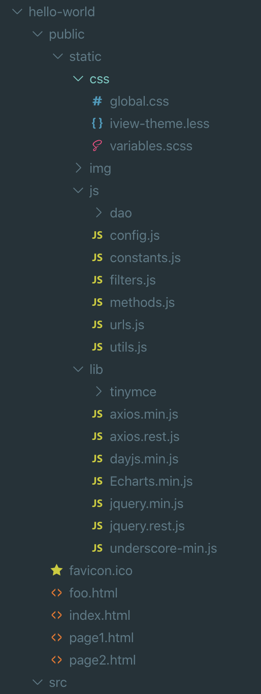

对于要使用的静态文件，例如我们自己写的 CSS，JS，第三方库等，可以放到 `public/static` 文件夹下，参考下面的目录结构:



* css: 存放我们自己写的样式文件
* img: 存放图片文件
* js: 存放我们自己写的 js 文件
* lib: 存放第三方库，例如 axios, echarts 等

在 `${subpage}.html` 中引用它们 (使用绝对地址 `/static/xxx` 访问):

```html
<!DOCTYPE html>
<html lang="en">

<head>
    <meta charset="utf-8">
    <meta http-equiv="X-UA-Compatible" content="IE=edge">
    <meta name="viewport" content="width=device-width,initial-scale=1.0">
    <link rel="icon" href="/static/img/favicon.ico">
    <link rel="stylesheet" href="/static/css/global.css">
    <title>测试</title>
</head>

<body>
    <div id="app"></div>

    <script src="/static/lib/dayjs.min.js"></script>
    <script src="/static/lib/tinymce/tinymce.min.js"></script>

    <!-- built files will be auto injected -->
</body>

</html>
```

我们自己写 CSS，JS 会经常修改，部署后为了让浏览器能够加载最新的文件，给它们的 URL 后面加上构建时的时间戳，浏览器加载的时候发现时间戳不一样，就会重新加载，而不是使用本地缓存的文件:

1. vue.config.js 中定义变量 `VUE_APP_VERSION`:

   ```js
   process.env.VUE_APP_VERSION = new Date().getTime();
   ```

2. 在 `${subpage}.html` 中我们自己写的 CSS，JS 的 URL 上使用此变量 (库文件的 URL 中不需要加此变量，因为库文件很少需要升级):

   ```html
   <!DOCTYPE html>
   <html lang="en">
   
   <head>
       ...
       <link rel="stylesheet" href="/static/css/global.css?<%= VUE_APP_VERSION %>">
   </head>
   
   <body>
       <div id="app"></div>
   
       <script src="/static/lib/dayjs.min.js"></script>
       <script src="/static/lib/tinymce/tinymce.min.js"></script>
       ...
   </body>
   
   </html>
   ```
   
   